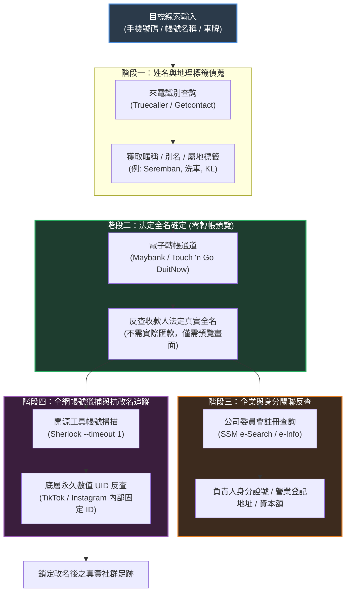
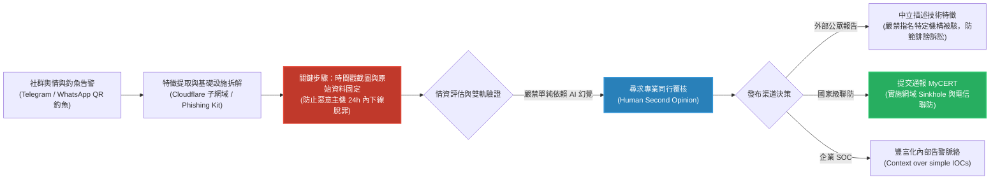

# 🎙️ Introduction to OSINT & Cyber Threat Intelligence (CTI) 技術精華筆記

> **會議主題**：Introduction to OSINT & Cyber Threat Intelligence (CTI) Sharing Session  
> **日期**：2026-09-27  
> **主講人**：
> - **Tunku Irfan**（OSINT 研究員、資安社群講師）
> - **foxy**（前威脅情資實習研究員、現役 CTI 分析師）  
> **核心領域**：開源網路情報（OSINT）、被動偵蒐（Passive Reconnaissance）、威脅情資分析（CTI）、釣魚基礎設施拆解、發布倫理與法律抗辯、MyCERT 協調通報  
> **關聯文件**：[📄 完整雙語原話逐字稿 (proofread.md)](./proofread.md)

---

## Executive Summary

本場資安線上技術研討會深入剖析了**開源網路情報（OSINT）**的實戰偵蒐手法，以及**威脅情資（Cyber Threat Intelligence, CTI）**在防禦一線的真實日常運作。

會議由 **Tunku Irfan** 率先示範如何透過公開管道進行被動身分串聯與漏洞定位，揭示了馬來西亞公共與教育體系長期存在的敏感資料暴露隱憂；下半場由 **foxy** 結合其在 CTI 團隊之實務經歷，深度拆解東南亞針對電子錢包之 QR Code 釣魚基礎設施與帳號劫持鏈（Account Takeover），並嚴正告誡研究員**「誠信遠勝於搶快（Integrity Over Speed）」**，公開發布威脅報告必須嚴格防範**名譽毀損（Defamation）**法律訴訟，並善用國家級應變中心（**MyCERT**）通報管道。會議尾聲收錄了兩位講者針對資安職涯、CTF 價值與社群即時聊天室之深度技術問答。

---

## 🏛️ 核心技術架構與分析流程圖

### 1. OSINT 被動偵蒐與身分反查流轉鏈 (Identity Pivot Chain)

---

### 2. CTI 威脅情資調查、證據保全與責任揭露生命週期

---

## 🔍 詳細技術段落剖析

### 一、 OSINT 被動偵蒐核心技術與合規防禦界線

#### 1. Doxxing（起底肉搜）與 OSINT（合法情資）的法律界線
* **違法 Doxxing**：因社群爭執或私人恩怨，非授權挖掘他人住家地址、親屬名冊或機敏身分證號並在公開平台散布曝光。此行為在馬來西亞及各國法律中皆構成刑事犯罪（侵犯個資與騷擾恐嚇）。
* **合法 OSINT**：僅在公開授權範疇（Public Domain）內，以被動方式收集威脅特徵、加固自身隱私或為資安防護提供威脅情報。

#### 2. 身分跳轉鏈（The Pivot Chain）實戰技巧
1. **來電標籤反查（Truecaller / Getcontact）**：利用群眾標籤獲取目標的社交暱稱、地域特徵（如 `Seremban`、`KL`）或從業背景（如 `Car Wash`）。
2. **零成本法定姓名反查（DuitNow 轉帳預覽）**：
   - 藉由行動銀行（Maybank / Touch 'n Go）發起手機 P2P 轉帳。
   - **關鍵點**：系統在最終點擊確認匯款前，必須向匯款人展示收款人的**法定註冊全名（Legal Registered Name）**。調查員無須完成交易，即可在預覽頁面取得 100% 官方驗證的真實全名。
   - *註：Maybank 在反覆查詢時不會打碼，穩定性高於 Touch 'n Go。*
3. **商業登記機構反查（SSM - Suruhanjaya Syarikat Malaysia）**：
   - 取得全名或商業登記號後，進入 SSM 官方入口（e-Search 或 e-Info）。
   - 可查閱該人員名下登記之獨資/合夥商號、公司登記地址、經營範圍與身分證末四碼。

#### 3. Google Dorking 高級語法矩陣
* `intext:"關鍵字"`：強制內文精確匹配，避免搜尋引擎拆詞。
* `intitle:"關鍵字"`：過濾 HTML `<title>` 包含關鍵字的頁面。
* `site:網域 / 國碼 TLD`：限定目標站台（如 `site:.my` 限定馬來西亞、`site:.il` 限定以色列、`site:tiktok.com` 限定特定平台）。
* `inurl:路徑`：限定特定 URL 路由特徵。
* `filetype:副檔名`：鎖定檔案類型（如 `filetype:pdf intext:sulit site:edu.my` 查找機密外洩文件；`filetype:png` 尋找透明圖示）。
* **布林排除運算子（`-`）**：在馬來西亞同名公眾人物（如 Tunku Irfan 鋼琴家）眾多的情境下，加上 `-intext:"Ismail"` 排除同名干擾，精確定位目標。
* **連網設備探勘**：`intitle:"webcam 7" inurl:8080`，可檢索出全球缺乏身分驗證、配置錯誤之 RTSP/VNC 監視器即時串流。

#### 4. Sherlock 跨平台枚舉與永久數值 UID 追蹤
* **Sherlock**：跨數百個主流社交平台（Discord, TikTok, Telegram, Threads, Spotify）自動化暴力枚舉使用者帳號名稱（`sherlock --timeout 1 <username>`）。
* **社群改名逃逸反制（Permanent User ID）**：
   - 社交平台帳號擁有三重屬性：**顯示名稱**（隨時更換）、**使用者帳號**（定期可改）、**底層 UID**（系統註冊分配之純數字，**終身不變**）。
   - 目標即使更換帳號名企圖抹除足跡，調查員只要調用先前保存的 UID（如 TikTok UID 工具），即可瞬間解析出改名後的最新帳號。

---

### 二、 CTI 實戰調查與惡意基礎設施拆解

#### 1. QR Code 釣魚攻擊鏈與帳號劫持（Account Takeover）
* **社交工程誘餌**：利用節慶開齋節（Raya）、政府補助等名目，在 Threads/Telegram 散播「領取發財金」QR Code。
* **憑證收割**：受害者掃碼進入仿冒 Touch 'n Go 電子錢包頁面，輸入手機門號與 OTP 驗證碼。
* **Session 劫持與擴散**：攻擊者登入受害者之 Telegram / WhatsApp，檢索近期最常聯繫的親友聊天室（父母、手足），發送「緊急需要周轉，請幫忙轉帳至此 QR」之訊息，利用信任關係達成連鎖詐騙。

#### 2. 基礎設施重複利用（Infrastructure Recycling）特徵
* 攻擊者受限於運營成本，不會為每個釣魚專案重新購買獨立伺服器與頂級網域。
* **典型架構**：在單一主網域（常掛載於 Cloudflare CDN 偽裝）下建立龐大的子網域池（Subdomain Pool）。
* **快速輪替**：單一釣魚子網域遭檢舉失效後，攻擊者秒級切換至另一子網域繼續發動攻擊。
* **惡意載荷偽裝**：雙副檔名混淆（`Wedding.apk`、`document.pdf.vbs`、`.apk.exe`），誘騙受害者點擊執行。

#### 3. 證據保全第一準則：第一時間截圖與原檔留存
* **惡意資產的朝生暮死特性**：釣魚伺服器與 C2 節點可能在 24 小時內即被雲端服務商封鎖或攻擊者自行銷毀。
* **調查鐵律**：發現活動當下必須立即進行**時間戳截圖（Timestamped Screenshots）**、抓取原始 HTML/JS 源碼、固定 DNS 歷程與 SSL 憑證資訊。
* **嚴肅警告**：如果沒有完整的截圖與證據鏈，隨後撰寫的任何調查報告都將失去可驗證性（Auditability）。

---

### 三、 CTI 研究員的專業誠信、法律風險與責任通報

#### 1. 嚴防公眾名譽毀損（Public Defamation）訴訟
* 資安研究員常犯的致命錯誤：在社群上高調宣稱「某某銀行 100% 被攻陷了，證據在此」，而該機構並未官方證實。
* **法律風險**：即便技術面有發現異常，未經嚴密確認與官方核實的公開指控，將使研究員直接面臨**民事賠償與刑事誹謗起訴**。
* **報告原則**：保持客觀中立，僅陳述「發現某未受保護之伺服器包含特定特徵」，絕不過度引申或做出未經證實之斷言。

#### 2. 向國家級應變中心（MyCERT）負責任通報
* 私人研究員無法合法發動主動反擊（Hack Back）。
* 最有效的在地處置方式：將惡意基礎設施、釣魚工具包源碼與受害者特徵整理成結構化報告，提交給 **MyCERT (Malaysia Computer Emergency Response Team)**。
* 由 MyCERT 協調國家通訊委員會（MCMC）與電信業者實施全網 DNS Sinkhole 與惡意 IP 封鎖。

#### 3. 情境脈絡（Context）遠勝於單純 IOC
* 單純收集 IP 與檔案 Hash 的價值極低（IP 隨時釋放、Hash 改變 1 byte 即失效）。
* CTI 的核心價值在於提供**情境脈絡**：威脅行為者的動機、社交工程手法、基礎設施生命週期、受害族群分布與防禦決策依據。

#### 4. 人類第二意見覆核 vs. 嚴防 AI 幻覺
* **LLM 陷阱**：大型語言模型具備「討好性（Sycophancy）」，無論你的假說多麼離譜，AI 都會生成文筆流暢、言之鑿鑿的段落來附和。
* **防禦鐵律**：**文筆流暢絕不等於事實證據（Fluency is NOT Evidence）**。所有關鍵歸因必須經由專業資安同行（Human Second Opinion）獨立審查。

---

### 四、 資安與威脅情資職涯指南（AMA 關鍵問答）

| 提問方向 | 講者核心建議 (foxy & Tunku Irfan) |
| :--- | :--- |
| **技職 / 專科生能否進入資安？** | **完全可行**。第一線資安團隊看重的是基礎紮實度與實作熱情。建立個人部落格撰寫深度的技術剖析（Writeups）、架設 Home Lab 靶場、考取 AWS 雲端基礎證照，並在 LinkedIn 上主動有禮貌地與資安主管交流。 |
| **CTF 比賽經驗是否必備？** | CTF 能證明解決問題的逆向思維，對紅隊或滲透測試履歷極具加分效果；但自研實用專案（如基於 Volatility 開發記憶體鑑識工具、分析真實惡意樣本）更能展現獨立研究能力。 |
| **進入 CTI 前必須先做 SOC 嗎？** | 不一定。雖然 SOC 經驗能讓人熟悉真實告警量，但也有企業直接招收 CTI 實習生。鑑於初階 CTI 職缺較少，從 SOC 監控切入仍是穩健路徑。 |

---

### 五、 會議即時文字聊天室互動精華 (In-Meeting Live Chat)

會議進行期間，與會聽眾在即時聊天室中分享了諸多極具價值的實務經驗與在地安全情報：
1. **馬來西亞教育部 SAPS 歷史脆弱性（Ahmed 分享）**：
   - 早期學校考試分析系統（SAPS）存在重大認證缺陷，攻擊者只要隨機輸入馬來西亞身分證號（IC），即可在未受任何存取控制的情況下，直接調閱全國學生的所屬學校、就讀班級與歷年成績。
2. **車牌情資反查管道（Imran, Abdul Shukur, FARIS 探討）**：
   - 討論如何針對車牌進行 OSINT。陸路交通局（JPJ）與交警系統已逐步收緊查詢介面，但聽眾指出民間專門替銀行拖吊違約車輛的「拖車集團（Geng Tarik Kereta）」掌握了高度私有化的車牌追蹤資料庫與特殊管道。
3. **社群舊照背景以圖搜圖定位住址（piwww 分享）**：
   - 分享社群肉搜反查住址技巧：翻找目標多年以前與家人的生活舊照，擷取包含社區特徵、街景或獨特建築之背景，利用 Google Lens / Yandex 執行反向圖像搜尋（Reverse Image Search），極易精準鎖定目標之私人住宅社區。

---

## 🛡️ Actionable Takeaways & 個人與企業防護清單

### 1. 個人隱私加固指南 (Personal OPSEC)
- [ ] **脫鉤社群與法定身分**：社群平台嚴禁使用真實法定全名，頭像避免使用正面高解析度生活照。
- [ ] **防範 DuitNow 姓名洩漏**：檢視銀行與電子錢包設定，將轉帳顯示名稱自訂為化名（若銀行機制允許）或避免將常用私人手機綁定公開收款。
- [ ] **社群舊照背景清洗**：定期排查並刪除過往拍攝到門牌號碼、社區地標、車牌或登機證條碼之歷史照片。
- [ ] **警惕身分證號（IC）外流**：切勿在任何非必要之問卷、會員登記或社群活動中填寫真實身分證字號。

### 2. 企業與 CTI 團隊作業準則
- [ ] **嚴格落實證據鏈保全（Chain of Custody）**：發現惡意資產當下，立即採取時間戳截圖與原始封包/源碼存檔，防範伺服器迅速離線。
- [ ] **報告發布遵守免責與同行審核機制**：所有公開研究報告必須經由內部或資深同儕二審（Human Second Opinion），嚴禁在缺乏官方通報前對外斷言受害機構名稱。
- [ ] **主動對接國家級應變聯防**：高價值本地威脅情資優先提交 MyCERT，促成全網等級之快速封鎖與威脅下架。
