# 🛡️ MATH-03-BOOLEAN-LOGIC-HAIDAO-SUANJING 基礎數學與先修代數：布林代數電腦邏輯與海島算經重差術

> **課程主題**：基礎數學與數學史專題研討——布林代數與夏農開關電路邏輯、三國劉徽《海島算經》重差測量法  
> **報告講者**：熊浩程、蔣浩成、同學報告者  
> **核心模組**：Boolean Algebra, Claude Shannon Switching Circuits, Haidao Suanjing, Double Difference Surveying, History of Mathematics  
> **學習目標**：理解布林代數如何經由夏農開關理論轉化為現代晶片二進位邏輯，掌握劉徽以兩次測量（重差術）推演相似三角形求解無法直達目標之高深遠寬  
> **關聯文件**：[📄 完整原話逐字稿 (20241204-布林代數電腦邏輯與海島算經重差術.full.md)](./20241204-布林代數電腦邏輯與海島算經重差術.full.md)

---

## 🏛️ 代數邏輯與古代測量學演進之思維架構模型

```mermaid
flowchart TD
    subgraph BooleanLogic["西方：布林代數至現代數位電腦邏輯"]
        Boole["1854 喬治·布林 (George Boole)<br/>《思維規律》The Laws of Thought<br/>建立代數化邏輯體系 (0 與 1)"]
        Shannon["1937 克勞德·夏農 (Claude Shannon)<br/>MIT 碩士論文：繼電器開關電路符號分析<br/>證明開關電路可完全實現布林運算"]
        Gates["基本邏輯閘實現：<br/>AND (且)、OR (或)、NOT (反閘)、XOR (異或)"]
        DigitalAge["現代 VLSI 微處理器晶片<br/>二進位運算、暫存器與現代電腦運算時代"]
        Boole --> Shannon --> Gates --> DigitalAge
    end

    subgraph AncientSurveying["東方：三國劉徽《海島算經》重差測量體系"]
        Zhoubi["《周髀算經》日高圖啟發<br/>以立表測日影求太陽高度角"]
        LiuHui["三國魏國 劉徽 (約 263 年)<br/>原《九章算術注》第十卷「重差」<br/>《海島算經》九題測量體系"]
        DoubleDiff["重差術 (Double Difference)：<br/>設立兩支同高表竿 (前表與後表)<br/>測量兩次表影差與步距<br/>利用相似三角形比值消去無法直達之未知距離"]
        Applications["9大實際測量場景：<br/>望海島(島高)、望松(樹高)、南望方邑(城寬)<br/>望深谷(谷深)、登山望樓(樓高)、望波口(河寬)<br/>望清淵(池深)、望津(水闊)、登山望邑(城池面積)"]
        Evaluation["世界數學史高度評價：<br/>唐代算經十書教科書、明代徐光啟讚為測量精義<br/>清代梅文鼎稱奇葩、西方學者評超越西方千餘年"]
        Zhoubi --> LiuHui --> DoubleDiff --> Applications --> Evaluation
    end
```

---

## 🎯 核心重點整理 (Key Takeaways)

### 1. 布林代數與夏農開關電路（Boolean Algebra & Switching Circuits）
- **喬治·布林（George Boole, 1854）**：在《思維規律》（*The Laws of Thought*）中提出將邏輯陳述轉化為代數運算符號，集合論之交集（Intersection）、連集（Union）、補集（Complement）精確對應至邏輯真偽值（$0$ 與 $1$）。
- **克勞德·夏農（Claude Shannon, 1937）**：在麻省理工學院（MIT）發表的歷史性碩士論文中，提出以電器開關（開路為 $0$、閉合為 $1$）的串聯與並聯結構，實體化布林邏輯閘（AND、OR、NOT、XOR）。這項突破將純數學邏輯與物理電路無縫接軌，開啟了數位電腦與晶片工程的全新時代。

### 2. 劉徽《海島算經》重差術原理與測量體系
- **成書背景**：三國時期魏國數學家劉徽（被譽為「平民數學家」、「布衣數學家」）為《九章算術》作注時，有感於勾股章僅能解決可直達目標之簡單測量，因而在第九卷後增設第十卷「重差」，唐代獨立成冊並列入《算經十書》，惜宋元後多散佚，現行本主要輯錄自《永樂大典》。
- **重差術核心數學原理（相似三角形比例消元）**：
  - 當目標（如海島山頂）之基底與測量者之間隔有海水或深谷而無法直接步測水平距離時，在同一水平線上設立前後兩支等高表竿（高度均為 $h$，兩竿間距為 $d$）。
  - 分別自兩竿後退觀測山頂，測得兩次表影偏差數值。透過兩組相似三角形之比例聯立方程式，即可直接消去水平未知距離，精準推導出目標高度與海島距離。
- **《海島算經》九題涵蓋範疇**：
  1. **望海島**：測無法直達之孤島山峰高度與海面距離。
  2. **望松**：測生於高山上之松樹高與山勢。
  3. **南望方邑**：測遠方方城之城垣邊長與城池面積。
  4. **望深谷**：自崖邊俯測深谷之垂直深度。
  5. **登山望樓**：自山巔俯測山下樓閣之高度。
  6. **望波口**：隔水測量江河波口與對岸距離。
  7. **望清淵**：利用水平反射與全等比例測量深潭水深。
  8. **望津**：測量渡口橫向江面寬度。
  9. **登山望邑**：自高處俯瞰並測量遠方市鎮城邑之縱深與面積。

### 3. 數學史學評價與影響
- **明代徐光啟**：推崇劉徽重差之法為「測量學之精義」。
- **清代梅文鼎**：稱讚重差術為「中國測量學之奇葩」。
- **現代數學史家（如 Frank Swetz 等）**：指出劉徽在 3 世紀建立的重差幾何測量演算法與表竿測量體系，在精確度與系統性上領先西方類似三角測量理論近一千年。
