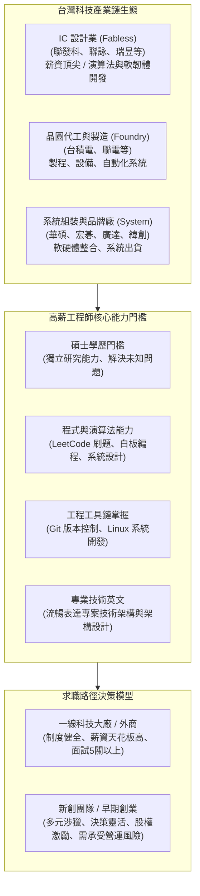

# 💼 CAREER-01-TECH-INDUSTRY-RECRUITMENT 職涯發展專題：科技產業鏈佈局、一線IC設計與外商徵才標準剖析

> **課程主題**：科技產業鏈薪資與生態、IC 設計一線廠與外商徵才標準、軟體工程師關鍵技能與求職策略  
> **授課講師**：職涯講師（資深科技業工程與獵才專家）  
> **核心模組**：Tech Industry Supply Chain, IC Design, Foreign Tech Firms, Interview Process, Git/Linux, Master Degree ROI  
> **學習目標**：全面解析台灣科技產業價值鏈分工、跨國外商五輪面試準備策略、工程工具鏈重要性與職涯路徑抉擇  
> **關聯文件**：[📄 完整原話逐字稿 (20241012-科技產業鏈佈局與外商求職策略.full.md)](./20241012-科技產業鏈佈局與外商求職策略.full.md)

---

## 🏛️ 科技產業鏈格局與軟體工程師求職決策架構

---

## 🎯 核心重點整理 (Key Takeaways)

### 1. 科技產業鏈架構與薪資層級
- **IC 設計業（無晶圓廠，Fabless）**：位居產業鏈頂端（如聯發科），提供市場最具競爭力的薪資水平，核心職缺重在演算法設計、數位/類比 IC 設計與底層系統軟韌體。
- **製造與晶圓代工（Foundry）**：以台積電為首，著重製程整合、設備自動化與高良率量產管控。
- **系統廠（System Integrator）**：整合各晶片組、PCB 板與機殼外裝進行整機出貨，偏向應用端系統整合。

### 2. 碩士學歷與研發能力之本質
- **人資系統篩選機制**：一線大廠後台履歷篩選門檻嚴格，碩士學歷是快速跨越第一道關卡的關鍵籌碼。
- **企業重視碩士的核心理由**：碩士論文研究歷程驗證了個人具備「定義問題、查閱前沿文獻、獨立實作驗證、解決未知工程難題」的獨立研發思維，而非僅能執行單一指定作業。

### 3. 外商與一線大廠面試實戰要領
- **多關卡考核（5 輪起跳）**：涵蓋演算法測驗、線上編程（Coding Assessment）、白板架構設計、主管技術深究與 HR 文化契合度。
- **技術工具鏈為必備基本功**：
  - **Git 版本控制**：能清楚交代 branch 策略、PR 審查流程與衝突處理解決經驗。
  - **Linux 系統**：精熟命令列環境、Shell 腳本與底層環境配置。
- **技術英文表達**：外商不強求完美文法或口音，但極度重視「能否用英文清楚且有邏輯地向非母語團隊說明專案架構與技術取捨」。

### 4. 大廠 vs 新創之職涯決策
- **大廠優勢**：培訓制度完善、流程規範嚴謹、專案規模大，適合作為職涯起步建立標準工程規範。
- **新創優勢與風險**：一人分飾多角、全棧實戰成長速度快、能參與商業核心決策；但需審慎評估團隊資金跑道（Runway）與產品市場媒合度（PMF）。
