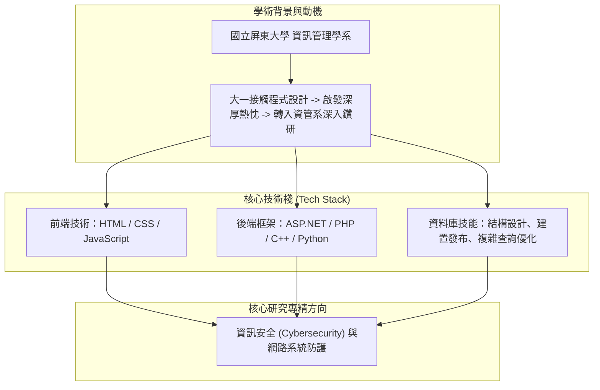

# 💼 CAREER-02-SELF-INTRODUCTION-TECH-STACK 職涯發展專題：資管專業自我介紹演練、程式語言與全端資料庫技能自述

> **演練主題**：求職面試個人專業自述、跨領域轉系動機、全端程式開發與資料庫技能樹展現  
> **發表學員**：蔣若成（屏東大學資管系學員）  
> **核心模組**：Self Introduction, Full-Stack Tech Stack, Database Management, Cybersecurity Passion  
> **學習目標**：精熟一分鐘至三分鐘結構化技術自述技巧、有條理呈現個人技能廣度與核心優勢  
> **關聯文件**：[📄 完整原話逐字稿 (20241025-資訊專長自我介紹與技術履歷自述.full.md)](./20241025-資訊專長自我介紹與技術履歷自述.full.md)

---

## 🏛️ 個人技術棧架構與職涯發展地圖

---

## 🎯 核心重點整理 (Key Takeaways)

### 1. 學術歷程與轉系動機
- **自我定位清晰**：就讀於國立屏東大學資訊管理學系，大一接觸程式邏輯後確立熱忱，主動跨領域轉入資管專業深化軟體工程實力。

### 2. 多元技術棧全面布局
- **全端開發基礎**：前端熟練 HTML/CSS/JavaScript，後端掌握 ASP.NET、PHP、C/C++ 及 Python 多元語言。
- **資料庫管理能力**：具備實體關聯設計、資料庫建置設定、SQL 結構化查詢與效能優化之實作經驗。
- **資安核心導向**：將軟體工程實作與資訊安全防護緊密結合，作為未來深造與職涯核心發展主軸。
