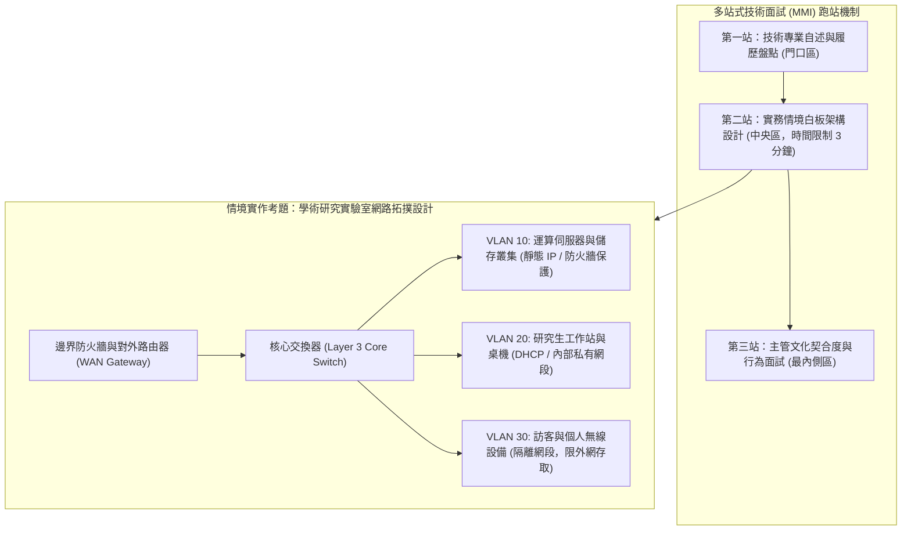

# 🖥️ CAREER-03-MOCK-INTERVIEW-LAB-TOPOLOGY 職涯發展專題：技術面試實體跑站演練——實驗室網路拓撲架構情境設計與口試

> **演練主題**：多站式技術面試跑站（MMI）、情境白板題解題技巧、研究型實驗室實體網路拓撲規劃  
> **面試人員**：技術面試官、應試學員  
> **核心模組**：Technical Mock Interview, Whiteboard Design, Lab Network Topology, VLAN Segmentation  
> **學習目標**：掌握技術白板面試解題框架、短時間內精準繪製具安全性考量之企業級網路拓撲  
> **關聯文件**：[📄 完整原話逐字稿 (20241026-技術面試跑站演練實驗室網路拓撲規劃.full.md)](./20241026-技術面試跑站演練實驗室網路拓撲規劃.full.md)

---

## 🏛️ 多站式面試機制與實驗室網路拓撲架構圖

---

## 🎯 核心重點整理 (Key Takeaways)

### 1. 多站式技術面試（Mini-Multiple Interview, MMI）規範
- **嚴格時限掌控**：各站設定 2~3 分鐘計時鈴聲，考驗應試者在極限高壓環境下快速提煉關鍵架構之敏捷反應力。
- **動態白板答辯**：面對面試官即興丟出之情境考題，需在有限時間內完成拓撲草圖並清晰口述設計哲學。

### 2. 實驗室網路拓撲設計核心架構
- **安全性與網段隔離（Segmentation）**：
  - 核心運算主機（GPU 伺服器、NAS 儲存）配置獨立 VLAN，透過存取控制清單（ACL）管制外部連線。
  - 研究生開發桌機與訪客 Wi-Fi 徹底隔離，避免個人自備設備（BYOD）潛在惡意軟體橫向擴散。
- **備援與擴展性**：設計單臂路由器（Router-on-a-Stick）或 Layer 3 交換器互連，保留未來算力節點擴充之彈性。
