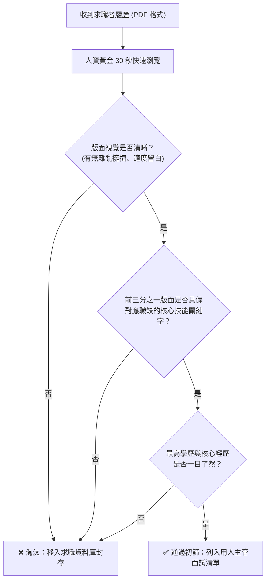

# 🛡️ CAREER-02-HR-PSYCHOLOGY-LAYOUT 職涯發展與就業輔導 Lesson 02：人資篩選心理學、履歷投遞時機與版面視覺優化

> **課程主題**：人資（HR）履歷篩選心理學、30 秒黃金掃描法則、個資去識別化原則與 1.5 倍行距排版美學  
> **授課教授**：授課講師（職涯就業輔導顧問）  
> **核心模組**：HR Resume Screening, 30-Second Rule, Privacy Protection, Typography, Line Spacing  
> **學習目標**：掌握人資篩選技術履歷的關鍵視角，平衡個人隱私防護與求職誠信，並運用專業排版強化閱讀舒適度  
> **關聯文件**：[📄 完整原話逐字稿 (2024-11-25-02-人資篩選心理與履歷視覺-proofread.md)](./2024-11-25-02-人資篩選心理與履歷視覺-proofread.md)

---

## 🏛️ 人資（HR）履歷初篩 30 秒掃描決策模型

---

## 🎯 核心重點整理 (Key Takeaways)

### 1. 人資履歷篩選速度與心理機制
- **黃金 30 秒法則**：針對初階工程師或一般專員職缺，人資每次面對數百封投遞，平均僅停留 20 到 30 秒掃描關鍵字；主管職位才會逐行研讀。
- **投遞黃金時機**：避免在週五下午或週末深夜投遞，最佳時段為週二至週四上班日早晨，以確保履歷排列在人資收件箱最上方。

### 2. 個資保護與身分證字號揭露考量
- **防範資料外洩與偽冒**：在公開求職平台初期投遞時，身分證字號、完整戶籍地址無須完全暴露，可採去識別化處理（例如僅揭露首字母與前幾碼，後續錄取簽約時再補齊）。

### 3. 版面視覺排版細節
- **行距與留白**：文字間距切忌緊密堆疊，建議設定 **1.5 倍行高**，適度分段並建立視覺層次，大幅減輕審閱者之視覺疲勞。
