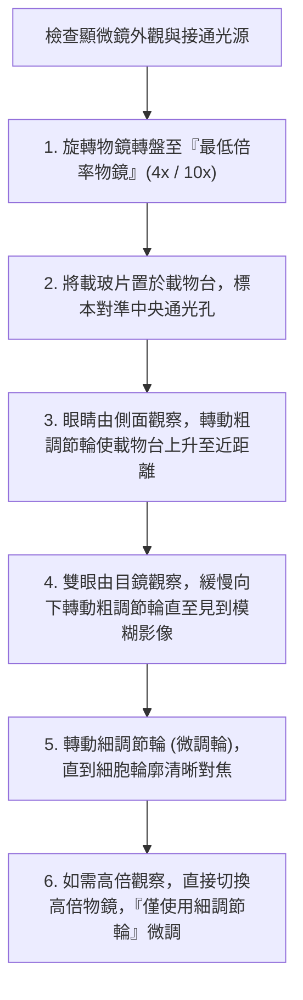

# 🛡️ BIO-01-LAB-MICROSCOPY-EXAM-GUIDELINES 普通生物學實驗 Lesson 01：光學顯微鏡細胞觀察實作與期中考操作規範

> **實驗課程主題**：普通生物學實驗、複式光學顯微鏡標準操作流程（SOP）、暫時玻片標本製作與期中操作考評量規範  
> **授課教授**：授課講師（普通生物學實驗教授）  
> **核心模組**：Optical Microscopy, Specimen Preparation, Focus Adjustment, Cytological Observation, Lab Safety  
> **學習目標**：精熟光學顯微鏡由低倍鏡至高倍鏡之對焦操作程序，掌握動植物細胞切片觀察重點並嚴格恪遵實驗室安全紀律  
> **關聯文件**：[📄 完整原話逐字稿 (2024-10-24-01-顯微鏡細胞觀察與操作規範-proofread.md)](./2024-10-24-01-顯微鏡細胞觀察與操作規範-proofread.md)

---

## 🏛️ 複式光學顯微鏡標準對焦與操作工作流程 (Microscopy SOP)

---

## 🎯 核心重點整理 (Key Takeaways)

### 1. 光學顯微鏡對焦黃金原則
- **先低倍後高倍**：尋找視野目標物必須始終從最低倍率物鏡開始，不可直接跳用高倍物鏡，以防視野過小迷失或物鏡直接碰撞壓破蓋玻片。
- **高倍鏡下嚴禁粗調節輪**：切換至高倍物鏡（40x/100x）後，物鏡前端與載玻片距離極短，**僅能轉動細調節輪（Fine Focus）**，否則極易壓碎玻片標本並刮傷高精密透鏡。

### 2. 期中實驗操作考注意事項
- **準時與紀律**：操作考設有嚴格的跑站計時，遲到將直接扣減該站測驗時間。
- **標本真實記錄**：依據目鏡視野下實際觀察到的細胞壁、細胞核與葉綠體形態繪製紀錄，切忌抄襲教科書示意圖。
