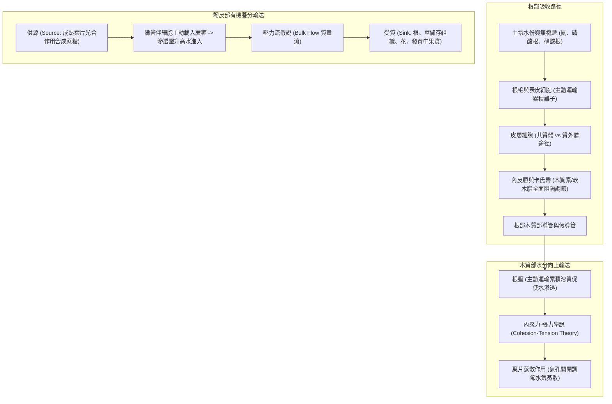

# 🌿 BIO-02-PLANT-PHYSIOLOGY-TRANSPORT 普通生物學：植物生理學、根部水分無機鹽吸收與維管束輸送機制

> **課程主題**：普通生物學植物生理學、根部水分無機鹽吸收、木質部內聚力張力學說與韌皮部壓力流假說  
> **授課教授**：授課講師（普通生物學授課教授）  
> **核心模組**：Plant Physiology, Root Absorption, Casparian Strip, Cohesion-Tension Theory, Transpiration, Phloem Pressure-Flow  
> **學習目標**：掌握植物根部水分與礦物質吸收路徑、內皮層卡氏帶過濾機制、木質部蒸散拉力與韌皮部壓力流假說  
> **關聯文件**：[📄 完整原話逐字稿 (20241107-01-植物生理學與水分養分輸送機制.full.md)](./20241107-01-植物生理學與水分養分輸送機制.full.md)

---

## 🏛️ 植物水分與養分體內雙軌長途運輸系統架構

---

## 🎯 核心重點整理 (Key Takeaways)

### 1. 根部吸收水分與無機鹽途徑
- **主動運輸累積離子**：表皮與皮層細胞透過主動運輸逆濃度梯度將土壤中的硝酸根、磷酸根等無機鹽泵入細胞內部，形成高滲透壓。
- **共質體 (Symplastic) 與質外體 (Apoplastic) 途徑**：
  - **質外體途徑**：水與溶質沿著細胞壁與細胞間隙擴散，不受細胞膜選擇性通透控制。
  - **共質體途徑**：水與溶質穿透細胞膜，透過原生質絲（Plasmodesmata）在細胞質內部傳遞。
- **卡氏帶 (Casparian Strip) 檢查哨**：內皮層細胞壁具有軟木脂（Suberin）浸潤沉積的帶狀構造，完全阻斷質外體水分流通，強制所有水分與無機鹽必須通過細胞膜受質膜轉運蛋白精密過濾。

### 2. 水分向上運送機制：內聚力-張力學說 (Cohesion-Tension Theory)
- **蒸散拉力 (Transpiration Pull)**：葉肉細胞間隙水分蒸散至大氣中，在氣孔周邊形成負壓（張力）。
- **水分子物理特性**：
  - **內聚力 (Cohesion)**：水分子間以氫鍵緊密互吸，維持木質部導管中水柱不斷裂。
  - **附著力 (Adhesion)**：水分子與木質部細胞壁（親水性纖維素）互吸，抵抗重力拉力。
- **根壓 (Root Pressure)**：夜間或潮濕環境蒸散微弱時，根部持續主動泵入離子促使水分滲透進入導管，產生微弱正壓（導致泌溢現象 Guttation）。

### 3. 韌皮部養分運輸：壓力流假說 (Pressure-Flow Hypothesis)
- **蔗糖載入 (Phloem Loading)**：供源葉肉細胞產生的蔗糖透過伴細胞以次級主動運輸載入篩管，使篩管滲透壓急遽上升。
- **水流注入與膨壓差**：相鄰木質部導管內水分因滲透壓差流入篩管，在供源端產生極高膨壓。
- **批量流動 (Bulk Flow)**：膨壓推動篩管液體向受質端快速流動；在受質端蔗糖被卸載利用或儲存，水分回流至木質部。
