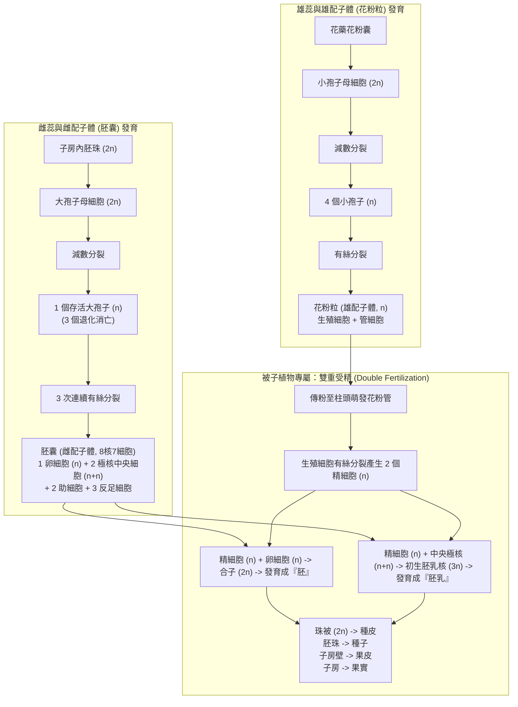

# 🌿 BIO-03-PLANT-REPRODUCTION-FERTILIZATION 普通生物學：被子植物花部構造、雌雄配子體發育與雙重受精機制

> **課程主題**：普通生物學被子植物花部構造、雌雄配子體減數與有絲分裂、雙重受精機制與種子果實發育  
> **授課教授**：授課講師（普通生物學授課教授）  
> **核心模組**：Angiosperm Flower, Stamen, Carpel, Microsporogenesis, Megasporogenesis, Double Fertilization, Seed & Fruit Development  
> **學習目標**：深入理解被子植物雄蕊與雌蕊細胞分裂週期、8核7細胞胚囊結構、雙重受精演化優勢與種子發育關係  
> **關聯文件**：[📄 完整原話逐字稿 (20241107-02-被子植物花部構造與生殖發育.full.md)](./20241107-02-被子植物花部構造與生殖發育.full.md)

---

## 🏛️ 被子植物雌雄配子體發育與雙重受精歷程全景圖

---

## 🎯 核心重點整理 (Key Takeaways)

### 1. 雄配子體（花粉粒）之發育
- **小孢子母細胞（2n）**：存在於花藥花粉囊中，經由一次減數分裂產生 4 個單套小孢子（n）。
- **花粉粒（雄配子體）結構**：小孢子進行有絲分裂形成雙細胞花粉粒：
  - **管細胞（營養細胞）**：負責在傳粉後萌發生長花粉管穿透花柱。
  - **生殖細胞**：於花粉管中再進行一次有絲分裂，產生 2 個無鞭毛的精細胞（n）。

### 2. 雌配子體（胚囊）之發育
- **大孢子母細胞（2n）**：位於子房內胚珠核心，經一次減數分裂產生 4 個大孢子，其中 3 個退化消亡，僅 1 個功能性大孢子存活。
- **8 核 7 細胞胚囊（雌配子體）**：存活的大孢子連續進行 3 次有絲分裂（細胞核分裂 3 次）：
  - **卵裝置（珠孔端）**：1 個卵細胞（n）與 2 個負責引導花粉管的助細胞（Synergids）。
  - **中央細胞**：含 2 個極核（Polar Nuclei, n + n）。
  - **反足細胞（合點端）**：3 個反足細胞（Antipodal Cells），提供養分代謝支持。

### 3. 被子植物特徵：雙重受精 (Double Fertilization)
- **第一受精作用**：第 1 個精細胞（n）與卵細胞（n）結合，形成雙套合子（2n），後續發育成新植物體的**胚（Embryo）**。
- **第二受精作用**：第 2 個精細胞（n）與中央細胞的 2 個極核（n + n）結合，形成三套初生胚乳核（3n），後續分裂發育成儲存養分的**胚乳（Endosperm）**。
- **花部組織轉變為果實種子對應關係**：
  - 胚珠 $\rightarrow$ **種子**；珠被（2n） $\rightarrow$ **種皮**。
  - 子房 $\rightarrow$ **果實**；子房壁 $\rightarrow$ **果皮**（外果皮、中果皮、內果皮）。
