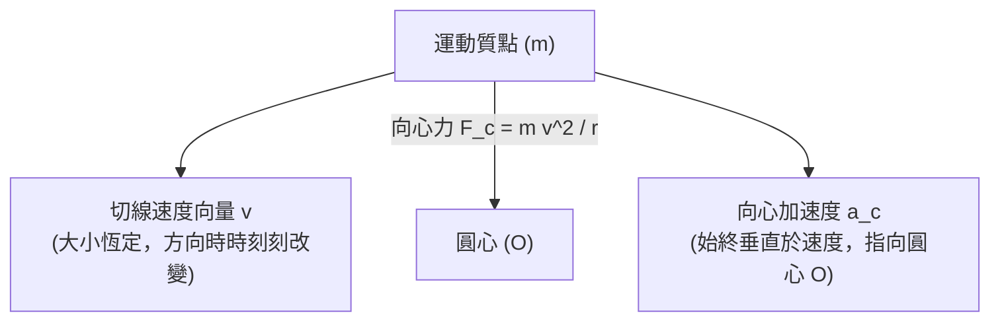

# 🛡️ PHYSICS-01-CIRCULAR-MOTION-COULOMB 普通物理學 Lesson 01：等速圓周運動切線速率、向心加速度與靜電庫侖定律

> **課程主題**：等速率圓周運動（Uniform Circular Motion）、切線速度向量、向心力、靜電荷庫侖定律與電場力線  
> **授課教授**：授課講師（普通物理授課教授）  
> **核心模組**：Uniform Circular Motion, Tangential Velocity, Centripetal Acceleration, Coulomb's Law, Electric Field Lines  
> **學習目標**：精確辨析等速度與等速率之向量本質，理解切線速度與向心加速度之幾何關係，掌握靜電作用力與電力線分佈  
> **關聯文件**：[📄 完整原話逐字稿 (2024-10-25-01-圓周運動切線速率與庫侖定律-proofread.md)](./2024-10-25-01-圓周運動切線速率與庫侖定律-proofread.md)

---

## 🏛️ 等速圓周運動之速度與加速度向量結構

---

## 🎯 核心重點整理 (Key Takeaways)

### 1. 「等速圓周運動」的真正物理意義
- **等速率而非等速度**：速度是具備「大小」與「方向」的向量。圓周運動中速率（純量大小）雖保持不變，但運動方向隨時間持續旋轉，因此**絕非等速度運動**，而是一種**具備加速度的變速度運動**。
- **沿切線飛出**：當繩索斷裂或向心力瞬間消失時，物體將依慣性定律（牛頓第一運動定律），沿著該瞬間的**切線方向（Tangential Direction）**以等速度直線飛出。

### 2. 靜電庫侖定律 (Coulomb's Law)
- **相互作用力**：帶電體間之靜電力大小與兩者電量乘積成正比，與距離平方成反比：
  $$F = k rac{|q_1 q_2|}{r^2}$$
- **電力線特徵**：由正電荷出發、終止於負電荷；線條疏密代表該處電場強度。
