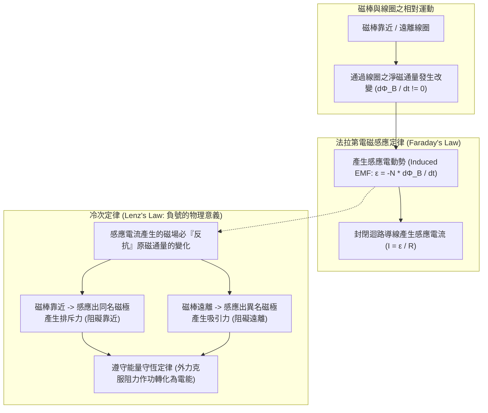

# ⚡ PHYSICS-03-ELECTROMAGNETIC-INDUCTION-LENZ 普通物理學：電磁感應、法拉第定律與冷次定律阻抗機制

> **課程主題**：普通物理學電磁感應、法拉第電磁感應定律量化關係、冷次定律抗拒機制與能量守恆  
> **授課教授**：授課講師（普通物理授課教授）  
> **核心模組**：Electromagnetic Induction, Magnetic Flux Change, Faraday's Law, Lenz's Law, Conservation of Energy, Induced EMF  
> **學習目標**：精熟磁通量變化率與感應電動勢量化計算，掌握冷次定律「增反減同、來拒去留」右手螺旋定則判定與物理本質  
> **關聯文件**：[📄 完整原話逐字稿 (20241108-電磁感應與法拉第冷次定律.full.md)](./20241108-電磁感應與法拉第冷次定律.full.md)

---

## 🏛️ 電磁感應定律與冷次定律作用架構

---

## 🎯 核心重點整理 (Key Takeaways)

### 1. 電磁感應基本原理與條件
- **磁通量變化為感應之源**：僅有靜態磁場無法產生感應電流；必須有通過線圈截面之**磁通量發生隨時間的改變（$\Delta \Phi_B 
eq 0$）**，才會在導線兩端誘發感應電動勢（Induced EMF, $\mathcal{E}$）。
- **電動勢與電流的先後因果**：
  - 有電壓（電動勢）不一定有電流（開路狀態僅有電位差）。
  - 有電流則必有電動勢與閉合導電迴路（$I = \mathcal{E} / R$）。
- **相對運動之實質**：無論是線圈固定磁鐵移動、磁鐵固定線圈移動，或線圈自身面積/角度旋轉改變，只要導致 $rac{d\Phi_B}{dt} 
eq 0$，效果完全等價。

### 2. 法拉第電磁感應定律 (Faraday's Law of Induction)
- **數學量化關係**：感應電動勢的大小與通過線圈迴路的磁通量變化率成正比：
  $$\mathcal{E} = -N rac{d\Phi_B}{dt}$$
  其中 $N$ 為線圈匝數，$\Phi_B = \int \mathbf{B} \cdot d\mathbf{A}$ 為通過單匝線圈的磁通量。
- **提升感應電動勢之途徑**：
  1. 增加磁場強度 $B$ 或增快相對移動速率（增大 $\Delta \Phi_B / \Delta t$）。
  2. 增加線圈密繞匝數 $N$。
  3. 增加線圈有效截面積 $A$。

### 3. 冷次定律 (Lenz's Law) 與能量守恆
- **冷次定律核心定義**：感應電流在迴路中所建立的磁場，其方向永遠旨在**反抗（阻礙）原激勵磁通量的變化**。
  - **增反減同**：若穿過線圈的磁通量增加，感應磁場方向與原磁場**相反**以抵銷增加；若磁通量減少，感應磁場方向與原磁場**相同**以補償減少。
  - **來拒去留**：N 極靠近線圈端面時，線圈端面感應出 N 極互相排斥；N 極遠離時，感應出 S 極互相吸引。
- **微觀能量守恆本質**：若冷次定律方向相反（即感應磁場助長磁通變化），則無需外力即可產生無限電流，將徹底違背熱力學與能量守恆。外力推動磁棒克服電磁阻力所作的機械功，恰好 100% 轉化為線圈迴路中的電能與焦耳熱。
