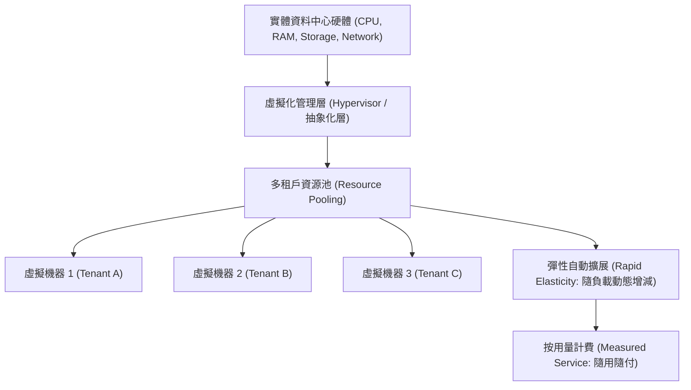

# 🛡️ CLOUD-01 雲端運算導論 Lesson 01：雲端本質剖析、伺服器虛擬化與現代資料中心集中運算

> **課程主題**：雲端運算導論、電腦硬體虛擬化本質、資源彈性調度與現代資料中心  
> **授課教授**：授課講師（資管系雲端架構授課教授）  
> **核心模組**：Cloud Computing Fundamentals, Hardware Decoupling, Virtualization & Hypervisor  
> **學習目標**：釐清「雲」背後的物理實體主機本質、理解虛擬化抽象層如何實現資源池化  
> **關聯文件**：[📄 完整原話逐字稿 (2024-10-17-01-虛擬化架構與資料中心運算-proofread.md)](./2024-10-17-01-虛擬化架構與資料中心運算-proofread.md)

---

## 🏛️ 核心架構與概念流轉圖

---

## 🔑 重點提要 (Key Takeaways)

1. **雲端的真實本質**：雲端並非虛無飄渺，而是「別人的電腦」——透過高度自動化與虛擬化軟體，將集中在超大型資料中心的實體硬體切分為彈性運算單元。
2. **虛擬化（Virtualization）價值**：傳統單一主機運載率僅 10%~15%；透過虛擬化可將單一伺服器利用率提升至 70%~80%，大幅降低硬體與機房能耗成本。
