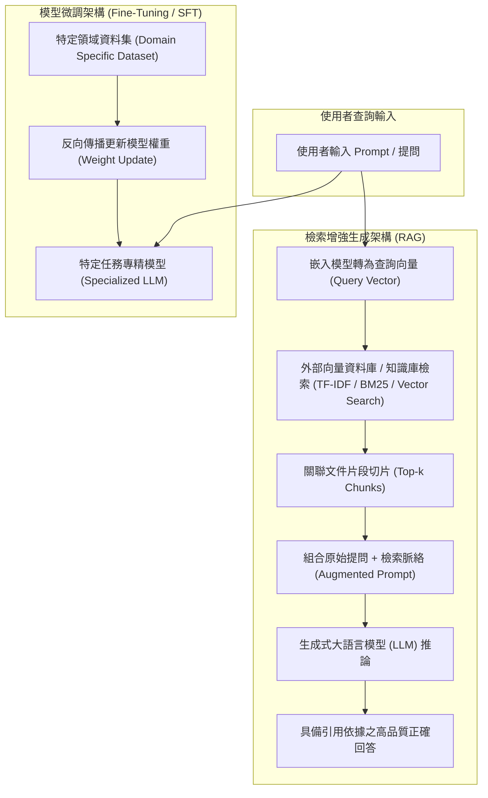

# ☁️ CLOUD-02-FINAL-PROJECT-RAG-FINETUNING 雲端運算期末成果：第七組 RAG 檢索增強生成與模型微調架構分析

> **課程主題**：雲端運算期末專題第七組成果發表、檢索增強生成（RAG）架構、微調（Fine-Tuning）技術對比與企業落地  
> **授課教授**：授課講師（資管系雲端運算授課教授）  
> **核心模組**：Retrieval-Augmented Generation (RAG), Fine-Tuning, TF-IDF/BM25, Vector Search, Knowledge Integration  
> **學習目標**：深度掌握 RAG 與 Fine-Tuning 底層差異、掌握企業外部知識庫整合流程與多模態版本管理規範  
> **關聯文件**：[📄 完整原話逐字稿 (20241219-期末專案第七組RAG與模型微調架構分析.full.md)](./20241219-期末專案第七組RAG與模型微調架構分析.full.md)

---

## 🏛️ RAG 檢索增強生成與模型微調架構對比

---

## 🎯 核心重點整理 (Key Takeaways)

### 1. RAG（檢索增強生成）三大核心工作流程
- **查詢向量化（Query Generation）**：將使用者自然語言提問透過 Embedding 模型轉為高維向量。
- **相關知識檢索（Knowledge Retrieval）**：在預定義的企業或領域知識庫中，結合向量語意搜尋（Dense Retrieval）與傳統關鍵字比對（TF-IDF、BM25 Sparse Retrieval）抓取高度關聯文本。
- **知識整合生成（Generation with Context）**：將檢索出的片段作為外部知識脈絡（Context）與原始問題拼接注入提示詞，使大語言模型在特定邊界內生成具可溯源性的精確解答。

### 2. RAG 與微調（Fine-Tuning / SFT）之技術定位與權衡
- **微調（Fine-Tuning）**：適用於改變模型行為風格、遵循特定結構化輸出格式（如 JSON Schema）或灌注高度內化的專業推理能力；但成本高昂、無法即時更新資料且容易產生幻覺。
- **RAG**：適用於需要**即時更新企業私有資料**、嚴格避免幻覺、降低算力訓練成本之場景（如金融法規審查、醫療病歷問答）。
- **混合架構（Hybrid Architecture）**：當代企業級應用的主流策略為「輕量微調領域模型 + 外掛即時 RAG 知識庫」。

### 3. 版本控制與工程落地建言
- **教授講評關鍵建議**：工程落地時不僅原始程式碼需透過 Git 進行嚴謹版本管理，知識庫切片、嵌入模型版本與向量庫索引亦須建立版本歷程記錄機制，確保生成結果具備可重現性（Reproducibility）與審計能力。
