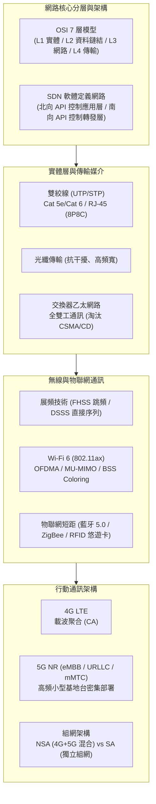

# 🌐 NET-MIDTERM-REVIEW-PAN-PHYSICAL-WIRELESS 電腦網路期中總複習：個人網路PAN、OSI與SDN架構、實體層傳輸媒介與無線區域網路技術

> **課程主題**：電腦網路期中核心考點盤點、OSI 與 SDN 網路分層架構、傳輸媒介（雙絞線/光纖）、無線展頻與 Wi-Fi 6、4G/5G 行動通訊架構  
> **授課教授**：授課講師（電腦網路授課教授）  
> **核心模組**：PAN, OSI 7 Layers, SDN (Northbound/Southbound API), FDM/PSK, Twisted Pair/Fiber, CSMA/CA, Spread Spectrum (FHSS/DSSS), Wi-Fi 6 (OFDMA/MU-MIMO), Bluetooth/RFID, 4G CA, 5G (eMBB/URLLC/mMTC/NSA/SA)  
> **學習目標**：掌握網路分層協定職責、有線與無線傳輸媒介物理特性、無線區域網路競爭機制與新世代 5G 行動通訊部署關鍵  
> **關聯文件**：[📄 完整原話逐字稿 (20241028-個人網路PAN與實體層傳輸架構.full.md)](./20241028-個人網路PAN與實體層傳輸架構.full.md)

---

## 🏛️ 電腦網路核心傳輸與無線架構關聯圖

---

## 🎯 核心重點整理 (Key Takeaways)

### 1. 網路架構與分層職責 (OSI & SDN)
- **個人網路 (PAN)**：個人設備短距互連（如藍牙、ZigBee），覆蓋範圍通常在數公尺內。
- **傳輸層 (L4) 四大任務**：切割上層資料、排定序號以供重組、流量控制（滑動視窗）、端對端偵錯與確認。
- **軟體定義網路 (SDN)**：控制層（Control Plane）與轉發層（Data Plane）分離。
  - **南向介面（Southbound API，如 OpenFlow）**：控制控制器與底層交換設備/資源層之間的溝通。
  - **北向介面（Northbound API）**：提供上層網路應用與業務邏輯調度底層網路資源。

### 2. 實體傳輸媒介與交換技術
- **雙絞線接頭規格**：標準 RJ-45 接頭（8P8C，內部 4 對共 8 條線芯），主流為 Cat 5e 與 Cat 6。
- **CSMA/CD 歷史演進**：早期間軸共享乙太網路使用 CSMA/CD 進行碰撞偵測；現代交換器（Switch）提供專屬微分割與全雙工傳輸，已使 CSMA/CD 走入歷史。
- **虛擬區域網路 (VLAN)**：核心效益包括隔離廣播風暴、突破實體佈線限制、提升網路存取安全與網段分流。

### 3. 無線區域網路與展頻技術
- **CSMA/CA**：無線網路無法有效邊送邊聽（半雙工且信號衰減快），故採碰撞避免（Collision Avoidance）而非碰撞偵測。
- **展頻技術**：
  - **FHSS（跳頻展頻）**：在多個頻率通道間依照偽隨機序列快速跳躍（如藍牙技術）。
  - **DSSS（直接序列展頻）**：將原始信號擴展至較寬頻帶，具極高抗雜訊能力。
- **Wi-Fi 6 (802.11ax)**：引進正交分頻多工存取（OFDMA）細分資源單元、多使用者多輸入多輸出（MU-MIMO）與 BSS Coloring 著色機制以大幅提升高密度場域效率。
- **RFID 與生活應用**：悠遊卡、一卡通均採用 RFID 無線射頻辨識技術。

### 4. 蜂巢式行動通訊演進 (4G/5G)
- **4G 載波聚合 (Carrier Aggregation, CA)**：將多個離散頻段頻寬合併，實現傳輸速率翻倍。
- **5G 三大核心場景**：
  1. **eMBB（增強型行動寬頻）**：超高速率、超大頻寬。
  2. **URLLC（超可靠低延遲通訊）**：毫秒級極致延遲，應用於自駕車與遠距醫療。
  3. **mMTC（巨量多機器通訊）**：每平方公里支援百萬級物聯網裝置接入。
- **5G 基地台密度**：5G 使用較高頻段（毫米波與 Sub-6GHz），電磁波衰減快、繞射能力弱，因此需要比 4G 密集許多的小型基地台（Small Cells）。
- **NSA vs SA 組網**：
  - **NSA（非獨立組網）**：沿用 4G EPC 核心網路，搭配 5G 新無線電（NR）基地台，適合建網初期過渡。
  - **SA（獨立組網）**：端對端全面採用 5G 雲原生核心網與 5G 基地台，能完整釋放 5G 網路切片與低延遲效能。
