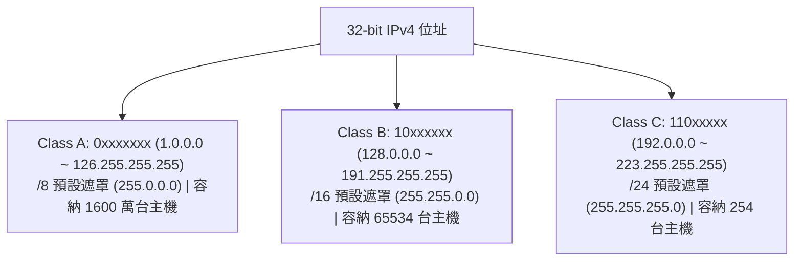

# 🛡️ NET-FINAL-REVIEW-IPV4-SUBNETTING 電腦網路期末總複習：IPv4 分類編址、子網路遮罩切割運算與網路安全加解密

> **課程主題**：電腦網路期末考點總盤點、IPv4 分類編址（Class A/B/C）、子網路遮罩切割（Subnetting）、密碼學加解密與 DDNS 實作  
> **授課教授**：授課講師（電腦網路授課教授）  
> **核心模組**：IPv4 Classful Addressing, Subnet Masking, FLSM, Symmetric/Asymmetric Encryption, DDNS  
> **學習目標**：精熟 IPv4 分類編址前導位元判定與子網路借位遮罩計算，掌握現代密碼學安全目標與動態網域名稱解析  
> **關聯文件**：[📄 完整原話逐字稿 (2024-12-23-期末總複習IPv4編址與網路安全-proofread.md)](./2024-12-23-期末總複習IPv4編址與網路安全-proofread.md)

---

## 🏛️ IPv4 傳統分類編址 (Classful Addressing) 結構

---

## 🎯 核心重點整理 (Key Takeaways)

### 1. IPv4 Class A/B/C 前導位元特徵
- **Class A**：第一個位元固定為 `0`（範圍 1 ~ 126）。第 1 個 Byte 為 Net ID，後 3 個 Bytes 為 Host ID。
- **Class B**：前兩個位元固定為 `10`（範圍 128 ~ 191）。前 2 個 Bytes 為 Net ID，後 2 個 Bytes 為 Host ID。
- **Class C**：前三個位元固定為 `110`（範圍 192 ~ 223）。前 3 個 Bytes 為 Net ID，最後 1 個 Byte 為 Host ID。

### 2. 子網路遮罩 (Subnet Mask) 切割公式
- **可用子網路數**：$2^n$，其中 $n$ 為向主機位元借用的位元數。
- **每個子網路可用主機數**：$2^h - 2$，其中 $h$ 為剩餘的主機位元數（減去網路位址與廣播位址）。

### 3. 資訊安全與加密核心
- **對稱式金鑰（Symmetric）**：加密與解密使用相同金鑰（如 AES），速度快，適合傳輸巨量數據。
- **非對稱式金鑰（Asymmetric）**：公鑰加密、私鑰解密（如 RSA/ECC），解決了金鑰分發難題。
