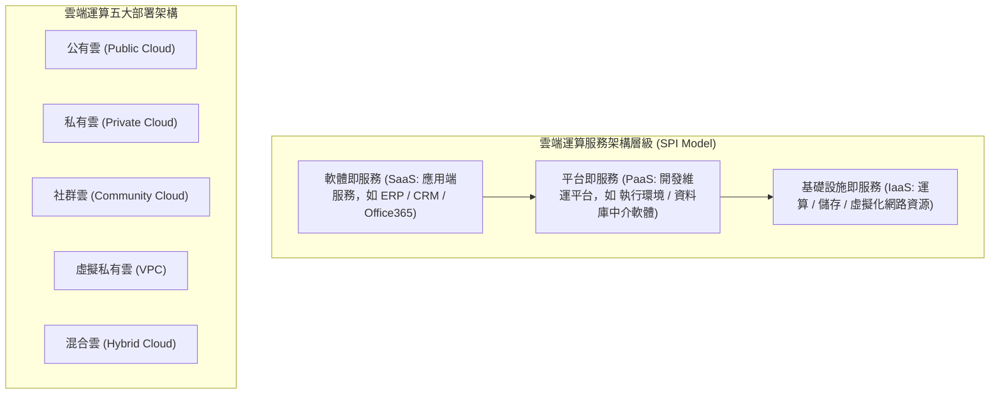
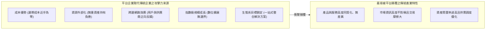

# 🛡️ MIS-01-MIDTERM-CLOUD-AI-PLATFORM 管理資訊系統 Lesson 01：期中重點總複習、雲端運算架構、大數據挑戰與平台經濟顛覆模型

> **課程主題**：管理資訊系統（MIS）期中重點總複習、雲端運算服務模型、大數據五大挑戰與雙邊市場平台經濟  
> **授課教授**：授課講師（資管系專任授課教授）  
> **核心模組**：MIS Fundamentals, Cloud Computing (IaaS/PaaS/SaaS), Big Data Challenges, Platform Ecosystems, AI & NLP  
> **學習目標**：掌握 MIS 支援組織策略的核心定義，辨析雲端運算架構與配置類型，解析大數據落地治理挑戰，並深刻剖析平台企業取代傳統產業的攻擊力成因  
> **關聯文件**：[📄 完整原話逐字稿 (2024-04-11-01-期中重點複習雲端運算與平台經濟-proofread.md)](./2024-04-11-01-期中重點複習雲端運算與平台經濟-proofread.md)

---

## 🏛️ 雲端運算三層服務與五大部署模式

---

## 📊 平台企業五大攻擊力來源與雙邊網路效應

---

## 🎯 核心重點整理 (Key Takeaways)

### 1. 管理資訊系統 (MIS) 核心定義
- **學術與實務定義**：MIS 是一門研究組織如何「有效利用與管理資訊科技（IT/IS）」，以支援其各項日常營運能力、全面提升經營效率，並達成組織長期策略目標的整合性管理學問。
- **組織與環境交互**：企業外部經營環境的劇烈變動（競爭對手技術創新、總體經濟趨勢與法規政策），會直接驅動並重塑企業內部 MIS 的架構定位與投資配置。

### 2. 雲端運算架構與大數據治理挑戰
- **三層服務模型**：
  - **SaaS (Software as a Service)**：終端使用者直接操作的完整應用層軟體服務。
  - **PaaS (Platform as a Service)**：提供開發者撰寫、測試與託管程式碼的平台環境與中介軟體。
  - **IaaS (Infrastructure as a Service)**：提供底層虛擬化伺服器主機、儲存硬碟與網路頻寬。
- **大數據落地五大挑戰**：
  1. **冷熱資料治理**：高頻存取熱資料與封存冷資料的分層儲存策略。
  2. **跨系統資料整合**：各部門孤島資料清洗與異質格式轉換困難。
  3. **領域知識（Domain Knowledge）**：缺乏業務專家解讀導致分析模型失焦。
  4. **資訊安全與個人隱私保護**：法規合規與機敏資料外洩風險。
  5. **抽樣偏差與樣本代表性**：演算法訓練樣本無法涵蓋真實母體分佈。

### 3. 雙邊市場平台經濟學與傳統企業顛覆
- **平台企業攻擊力來源**：具備零邊際成本、輕資產外部化資源運營、跨邊網路外部性（Network Externality）及數位生態系鎖定能力。
- **容易被平台取代的傳統行業特徵**：服務無實質差異性、市場資訊不對稱嚴重、交易中介抽成高昂且資產閒置率偏高（如傳統計程車業被叫車平台重構、傳統旅宿業被訂房平台重塑）。
