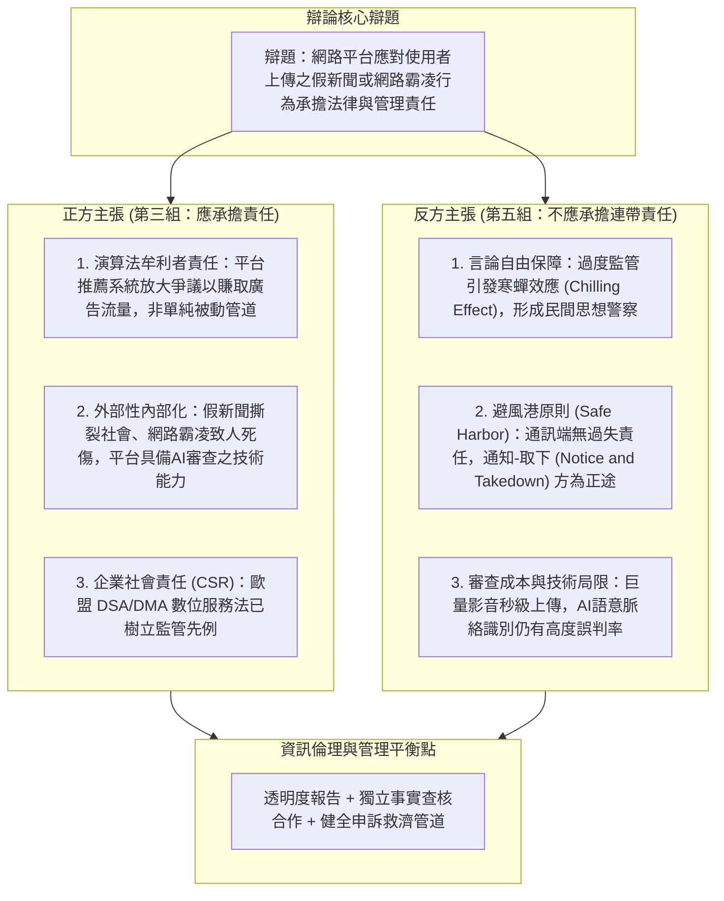

# ⚖️ MIS-03-ETHICS-DEBATE-PLATFORM-LIABILITY 管理資訊系統：資訊倫理專題辯論——網路平台是否應對假新聞與霸凌言論承擔法律責任

> **課程主題**：管理資訊系統資訊倫理專題辯論賽、社群網路平台對假新聞與霸凌言論之法律責任攻防  
> **授課教授**：授課教授（資管系管理資訊系統教授）  
> **核心模組**：Information Ethics, Platform Liability, Section 230, Safe Harbor, Chilling Effect, DSA Regulation  
> **學習目標**：深入思辨數位平台經濟之外部性與法律責任、掌握言論自由與內容審查之張力平衡  
> **關聯文件**：[📄 完整原話逐字稿 (20240516-資訊倫理辯論網路平台假新聞與霸凌責任.full.md)](./20240516-資訊倫理辯論網路平台假新聞與霸凌責任.full.md)

---

## 🏛️ 平台責任與資訊倫理辯論攻防體系架構

---

## 🎯 核心重點整理 (Key Takeaways)

### 1. 辯論核心衝突：平台角色定位之哲學辨析
- **管道論 vs 媒體論**：
  - **傳統避風港思維（反方）**：將社群平台視為如電信電話線般的「純粹傳輸管道」，不應對管道內流通之內容承擔侵權或誹謗之實質法律責任（參照美國 Section 230）。
  - **演算法策展思維（正方）**：現代社群平台透過黑箱推薦演算法、按讚激勵與個人化廣告投放，實質決定了資訊曝光權重，已具備「數位出版者與媒體門房」屬性，獲取商業利益同時必須承擔注意義務。

### 2. 監管手段與憲法權利之兩難
- **寒蟬效應（Chilling Effect）**：若平台面臨巨額連帶罰則，為避險將採取最嚴苛之預先審查機制，必然誤傷合法政治批判、新聞自由與弱勢群體發聲管道。
- **治理現代化架構（DSA 模型）**：歐盟《數位服務法》（Digital Services Act）採取折衷治理路徑：不要求普遍預先審查，但要求超大型線上平台（VLOP）實施「系統性風險評估、演算法透明度報告、以及與受信任查核機構合作」。

### 3. 課堂評分與團隊辯論技巧規範
- **論述一致性與證據力**：評分核心著重一辯立論、二辯質詢、三辯答辯至結辯是否有邏輯矛盾，並檢視數據證據是否來自政府統計、判例或同儕審查學術文獻。
- **白板支援機制**：現場規範組員不可在辯士發言時擅自中斷，必須運用小白板精準書寫關鍵字提示，考驗團隊無聲協同默契。
