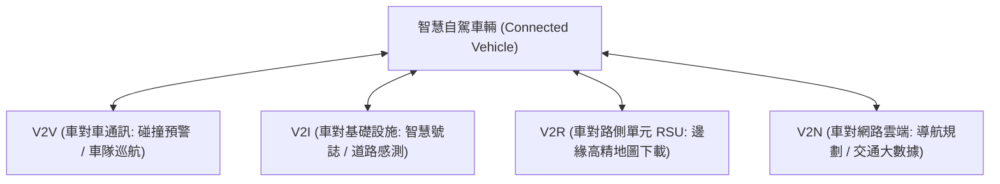
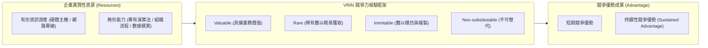

# 🛡️ MIS-02-FINAL-IOV-FINTECH-RBV 管理資訊系統 Lesson 02：期末重點總複習、車聯網 V2X 通訊、金融科技區塊鏈與資源基礎觀點 RBV

> **課程主題**：管理資訊系統（MIS）期末重點總複習、自駕車與車聯網（IoV）、金融科技（FinTech）與資源基礎觀點（RBV）  
> **授課教授**：授課講師（資管系專任授課教授）  
> **核心模組**：Autonomous Vehicles, Internet of Vehicles (IoV), V2X, FinTech, Blockchain, Resource-Based View (RBV)  
> **學習目標**：理解新一代車聯網智慧通訊架構，掌握 FinTech 與區塊鏈去中心化核心價值，並熟練運用 RBV 架構圖判別企業資訊系統競爭優勢  
> **關聯文件**：[📄 完整原話逐字稿 (2024-05-23-02-期末重點複習車聯網與RBV架構-proofread.md)](./2024-05-23-02-期末重點複習車聯網與RBV架構-proofread.md)

---

## 🏛️ 車聯網 (IoV) V2X 多維度通訊架構

---

## 📊 資源基礎觀點 (Resource-Based View, RBV) 與競爭優勢判讀

---

## 🎯 核心重點整理 (Key Takeaways)

### 1. 自駕車與車聯網 (Internet of Vehicles, IoV)
- **車聯網定義**：透過車載感測器、衛星導航及現代無線通訊技術，實現車輛與周遭人、車、路、雲全方位聯網互動之物聯網生態系。
- **V2X (Vehicle-to-Everything) 協同架構**：
  - **V2V (Vehicle-to-Vehicle)**：車輛間即時車距與行車狀態交換，支援防撞與緊急煞車預警。
  - **V2I (Vehicle-to-Infrastructure)**：與智慧交通號誌聯動，動態優化通過時速與綠燈通行率。
  - **V2R (Vehicle-to-Roadside)**：與路側基站單元（RSU）高速通訊，取得微區域路況與高精地圖更新。

### 2. 金融科技 (FinTech) 與區塊鏈去中心化核心
- **FinTech 核心理念**：金融科技本質在於利用新興資通訊技術（大數據、AI、分散式帳本、行動支付）重塑傳統金融仲介與服務交付模式，達成普惠金融、降本增效與無縫體驗。
- **區塊鏈 (Blockchain)**：透過分散式點對點網路、非對稱密碼學雜湊指標與共識機制，實現無須中心化第三方信任背書之防篡改資料帳本，確保資產交易的透明度與終局性。

### 3. 資源基礎觀點 (Resource-Based View, RBV) 模式架構
- **資訊系統競爭價值判讀**：企業單純建置採購現成的市售資訊系統（如標準 ERP），因為競爭對手亦能輕易在市場採購，僅能帶來「競爭平價（Competitive Parity）」，而非持續競爭優勢。
- **VRIN 準則結合**：唯有將資訊科技與企業獨特的組織文化、專利演算法、深層顧客數據及敏捷流程高度結合，創造出具備價值性（Valuable）、稀少性（Rare）、難以模仿（Inimitable）且不可替代（Non-substitutable）之複合能力時，方能轉化為不可撼動的「持續性競爭優勢（SCA）」。
