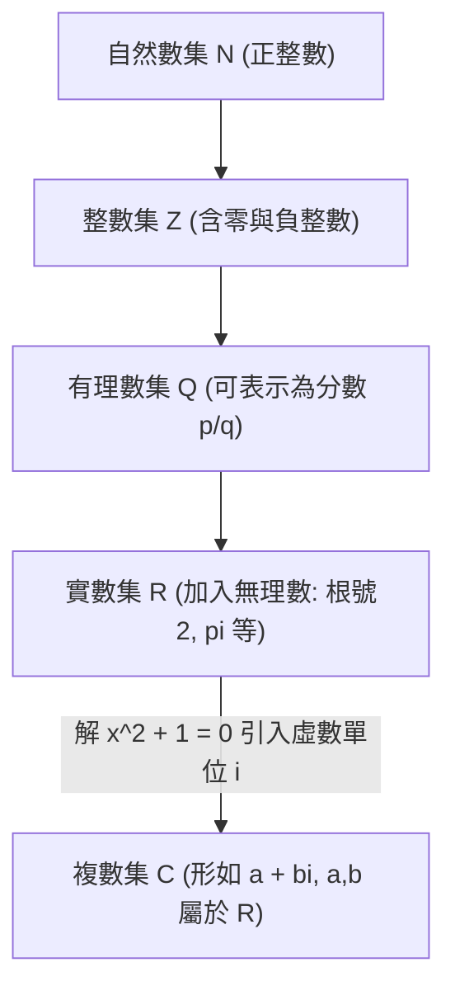
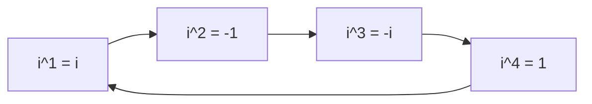

# 🛡️ MATH-01-COMPLEX-NUMBERS-SYSTEM-EXPANSION 基礎數學與先修代數 Lesson 01：數系擴張、虛數單位 i 定義與複數運算架構

> **課程主題**：數系擴張（Number System Expansion）、虛數單位 $i$、複數標準式 $a+bi$、虛數四次循環律與複數四則運算  
> **授課教授**：授課講師（應用數學授課教授）  
> **核心模組**：Number Systems, Imaginary Unit i, Complex Numbers, Cyclic Powers, Fundamental Theorem of Algebra  
> **學習目標**：理解數學史上將實數系擴張至複數系之必要性，精熟虛數單位 $i$ 的四次方循環特性與複數四則代數運算  
> **關聯文件**：[📄 完整原話逐字稿 (基礎數學-01-數系擴張虛數單位i與複數運算實務-proofread.md)](./基礎數學-01-數系擴張虛數單位i與複數運算實務-proofread.md)

---

## 🏛️ 數系擴張層級架構 (Hierarchy of Number Systems)

---

## 🔄 虛數單位 $i$ 之四次循環律 (Period-4 Cyclic Property)

---

## 🎯 核心重點整理 (Key Takeaways)

### 1. 數系擴張與「無解」的本質
- **無實數解 vs. 無解**：方程式 $x^2 + 1 = 0$ 在傳統實數系（$\mathbb{R}$）中無解；但透過數系擴張定義**虛數單位（Imaginary Unit）**：
  $$i = \sqrt{-1} \implies i^2 = -1$$
  使得該方程式在複數系中具備兩根 $x = \pm i$。
- **複數標準表示式**：任意複數 $z \in \mathbb{C}$ 均可寫為 $z = a + bi$，其中 $a = 	ext{Re}(z)$ 為實部，$b = 	ext{Im}(z)$ 為虛部。

### 2. 虛數單位 $i$ 的四次方週期循環律
- 任意整數次方 $i^n$ 均滿足以 4 為週期的循環規律：
  $$i^{4k+1} = i, \quad i^{4k+2} = -1, \quad i^{4k+3} = -i, \quad i^{4k} = 1 \quad (k \in \mathbb{Z})$$
- 此特性使得高次項代數運算可透過「指數除以 4 取餘數」快速化簡。
