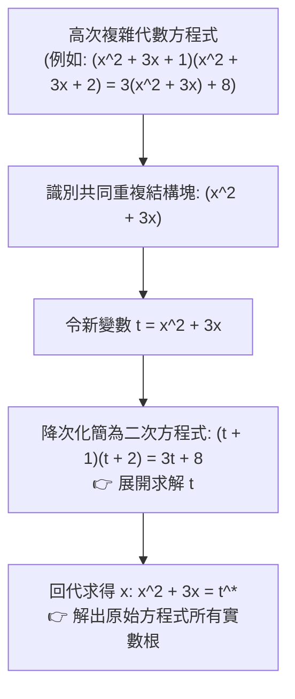

# 🛡️ MATH-02-EXAM-REVIEW-VARIABLE-SUBSTITUTION 基礎數學與先修代數 Lesson 02：多項式變數代換法、方根整數小數化簡與段考檢討

> **課程主題**：基礎數學段考核心難題檢討、多項式高次式變數代換技巧、無理數方根整數與純小數部分拆解  
> **授課教授**：授課講師（應用數學授課教授）  
> **核心模組**：Algebraic Substitution, Radical Simplification, Integer and Fractional Parts, Exam Review  
> **學習目標**：精熟令 $t = x^2 + 3x$ 之降次代換策略化簡複雜高次多項式，掌握無理數方根取整數與小數之代數操作  
> **關聯文件**：[📄 完整原話逐字稿 (基礎數學-02-多項式變數代換法與段考綜合試題檢討-proofread.md)](./基礎數學-02-多項式變數代換法與段考綜合試題檢討-proofread.md)

---

## 🏛️ 高次多項式「變數代換法」解題思維模型

---

## 🎯 核心重點整理 (Key Takeaways)

### 1. 變數代換法 (Variable Substitution) 降次心法
- **難題破局點**：若直接將四次多項式暴力展開，極易產生高階繁瑣計算與符號錯誤。透過觀察對稱結構，令 $t = x^2 + 3x$，可將四次方程式立即降解為一元二次方程式。
- **回代檢驗**：求出 $t$ 之後，務必回代二次方程式 $x^2 + 3x - t = 0$，並透過判別式 $D = b^2 - 4ac$ 檢驗是否有實數解。

### 2. 無理數方根的「整數部分」與「小數部分」
- 設 $\sqrt{N}$ 介於兩相鄰正整數之間 $k < \sqrt{N} < k+1$：
  - **整數部分（Integer Part）**：$a = \lfloor \sqrt{N} 
floor = k$。
  - **小數部分（Fractional Part）**：$b = \sqrt{N} - k \in (0, 1)$。
