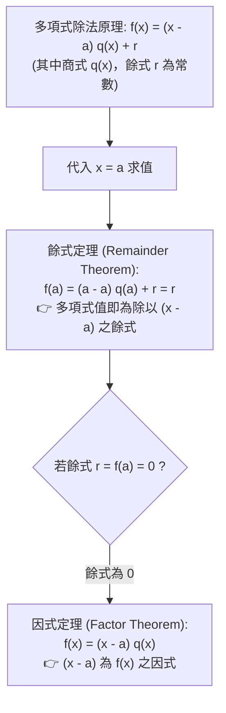

# 🛡️ MATH-03-FACTOR-THEOREM-POLYNOMIALS 基礎數學與先修代數 Lesson 03：多項式因式定理、餘式定理與高次代數分解實務

> **課程主題**：多項式餘式定理（Remainder Theorem）、因式定理（Factor Theorem）、高次多項式整係數因式分解與分配律逆推  
> **授課教授**：授課講師（應用數學授課教授）  
> **核心模組**：Remainder Theorem, Factor Theorem, Polynomial Factorization, Synthetic Division  
> **學習目標**：精熟 $f(a)=0 \iff (x-a) \mid f(x)$ 之因式定理雙向推論，掌握高次多項式一次因式檢驗法與分配律逆向因式提取  
> **關聯文件**：[📄 完整原話逐字稿 (基礎數學-03-多項式因式定理與高次代數分解實務-proofread.md)](./基礎數學-03-多項式因式定理與高次代數分解實務-proofread.md)

---

## 🏛️ 多項式除法原理與餘式／因式定理推論脈絡

---

## 🎯 核心重點整理 (Key Takeaways)

### 1. 因式定理 (Factor Theorem) 核心判據
- 若多項式 $f(x)$ 滿足 $f(a) = 0$，則 $(x - a)$ 必為 $f(x)$ 之一階一次因式。
- **多根因式推廣**：若 $a, b$ 為兩相異實數，且 $f(a) = 0, f(b) = 0$，則 $f(x)$ 必同時含有 $(x - a)$ 與 $(x - b)$ 因式，即 $(x - a)(x - b) \mid f(x)$。

### 2. 分配律逆推與因式分解
- 高次多項式因式分解本質上為乘法分配律的逆向操作：
  $$a \cdot c + b \cdot c = (a + b) \cdot c$$
- 透過一次因式檢驗法猜根（可能的根必在最高次係數因數與常數項因數之商），結合綜合除法降次，逐階抽離線性因子。
