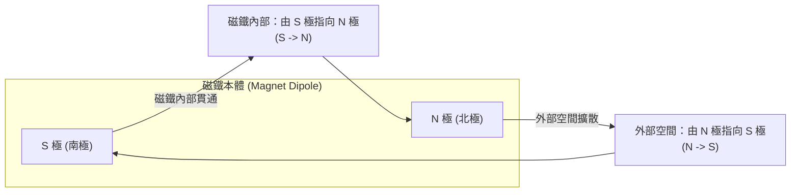

# 🛡️ PHYSICS-02-MAGNETIC-FIELDS-FLUX-LINES 普通物理學 Lesson 02：磁場分佈、磁力線封閉特性與磁通量物理機制

> **課程主題**：磁場（Magnetic Field）、磁力線封閉性、高斯磁定律（無磁單極）、磁通量與電磁學考點梳理  
> **授課教授**：授課講師（普通物理授課教授）  
> **核心模組**：Magnetic Field Lines, Closed Loops, Gauss's Law for Magnetism, Magnetic Flux, Dipole  
> **學習目標**：掌握磁力線內部與外部之連續封閉迴圈物理特性，理解磁力線疏密代表磁場強度大小之幾何意涵  
> **關聯文件**：[📄 完整原話逐字稿 (普通物理-02-磁場分佈磁力線封閉特性與磁通量解析-proofread.md)](./普通物理-02-磁場分佈磁力線封閉特性與磁通量解析-proofread.md)

---

## 🏛️ 磁力線封閉迴圈 (Closed Loops) 拓撲流向

---

## 🎯 核心重點整理 (Key Takeaways)

### 1. 磁力線的「封閉曲線」本質
- **無起點亦無終點**：電力線有始有終（始於正電荷，終於負電荷）；但磁力線是一條**連續不斷的封閉平滑曲線（Closed Loop）**。
- **流向規則**：
  - **磁鐵外部**：由 **N 極指向 S 極**。
  - **磁鐵內部**：由 **S 極指向 N 極**。
- **高斯磁定律（Gauss's Law for Magnetism）**：自然界中不存在孤立的磁單極（Magnetic Monopole），通過任何封閉曲面的淨磁通量必恆等於零：$\oint \mathbf{B} \cdot d\mathbf{A} = 0$。

### 2. 磁場強度與空間疏密關係
- **空間密集度**：磁力線越密集的地方（如磁極兩端近處），磁場強度越大；磁力線稀疏的地方，磁場強度越弱。
- **切線方向**：磁力線上任意一點的切線方向，即代表小磁針 N 極在該點所受磁力方向。
