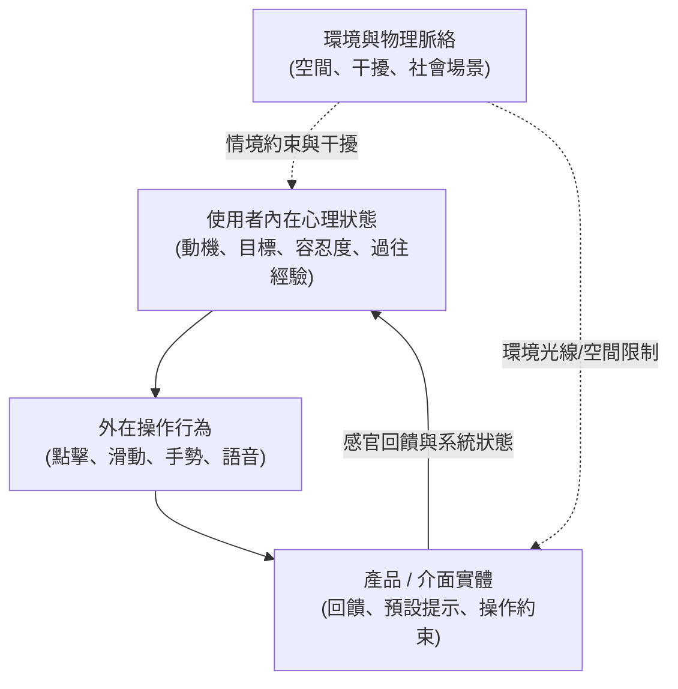
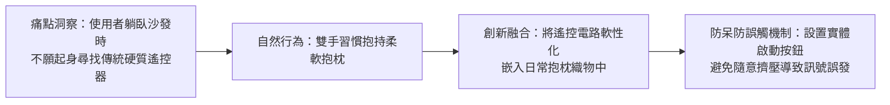

# 🛡️ HCI-01-MOTIVATION-ENVIRONMENT 人機互動與 UX 設計 Lesson 01：行為動機模型、人境互動模式與使用者心智模型

> **課程主題**：設計心理學（Design Psychology）、行為動機、人境互動（Person-Environment Interaction）與心智模型（Mental Model）  
> **授課教授**：授課講師（人機互動與工業設計教授）  
> **核心模組**：Mental Models, Behavioral Motivation, Person-Environment Interaction, Affordance, Error Prevention  
> **學習目標**：理解使用者內在動機如何轉化為外在操作行為，掌握環境脈絡與人際互動如何塑造產品之直覺互動體驗  
> **關聯文件**：[📄 完整原話逐字稿 (人機互動與UX設計-01-行為動機與人境互動模式-proofread.md)](./人機互動與UX設計-01-行為動機與人境互動模式-proofread.md)

---

## 🏛️ 人機互動 (HCI) 心智模型與情境互動架構

---

## 🛋️ 使用者行為驅動之產品創新模式 (以抱枕遙控器為例)

---

## 🎯 核心重點整理 (Key Takeaways)

### 1. 人與環境的互動哲學（生活 vs. 風景）
- **視角翻轉**：「對你來說是生活，對別人來說是風景」。互動設計必須跳脫設計師本位主義，深入使用者真實生活的日常脈絡（Context of Use）。
- **迷路的空間認知意涵**：迷路並非全然是負面的系統錯誤，而是人與空間環境在動態探索中重塑心智地圖（Cognitive Map）的過程。

### 2. 動機、行為與產品形式
- **複雜動機與外在行為**：人類的行為往往受多重複雜的內在動機驅動（例如省力、舒適、安全感）。優秀的設計順應人類自然的慵懶與直覺，而非強迫使用者適應生硬的機械結構。
- **操作約束與防呆設計（Error Prevention / Poka-Yoke）**：軟性互動介面（如織物或抱枕遙控）容易引發非意圖按壓，設計必須引入明確的確認動作或開關狀態約束，以消除誤操作。
