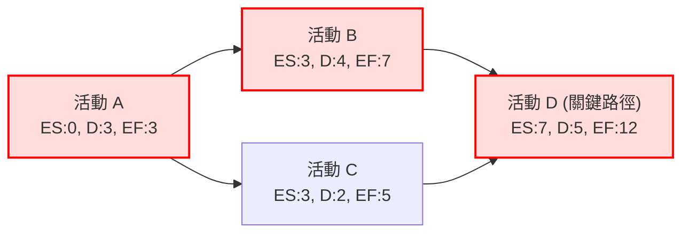
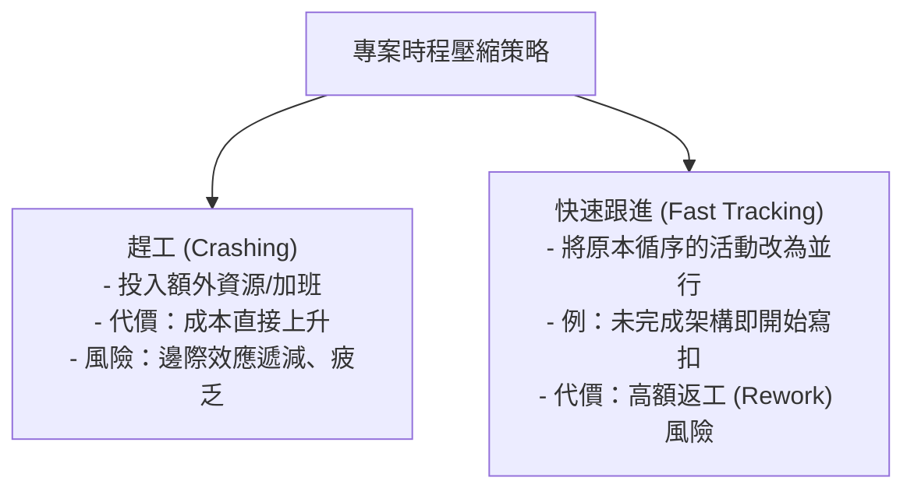

# 🛡️ PM-04-CPM-PERT-CHANGE-CONTROL 專案管理實務 Lesson 04：關鍵路徑法 CPM、PERT 三點時程估算、快速跟進風險與變更控制

> **課程主題**：關鍵路徑法（CPM）、PERT 三點估算、時程壓縮（Crashing vs. Fast Tracking）與變更控制程序  
> **授課教授**：授課講師（專案管理授課教授）  
> **核心模組**：Critical Path Method, PERT Estimation, Float/Slack, Schedule Compression, Change Control  
> **學習目標**：精熟正推法與逆推法計算活動最早／最晚起訖時間，評估快速跟進返工風險並建立變更控制基準線  
> **關聯文件**：[📄 完整原話逐字稿 (專案管理-04-關鍵路徑法CPM時程估算與專案變更控制-proofread.md)](./專案管理-04-關鍵路徑法CPM時程估算與專案變更控制-proofread.md)

---

## 🏛️ 關鍵路徑法 (CPM) 時間計算與浮動時間結構

---

## ⚡ 時程壓縮技術比較：趕工 (Crashing) vs. 快速跟進 (Fast Tracking)

---

## 🎯 核心重點整理 (Key Takeaways)

### 1. CPM 關鍵路徑演算法核心公式
- **正推法 (Forward Pass)**：計算最早時間
  - $EF = ES + \text{Duration}$
  - 當後續活動有多個前置活動時，取最大值：$ES = \max(EF_\text{predecessors})$。
- **逆推法 (Backward Pass)**：計算最晚時間
  - $LS = LF - \text{Duration}$
  - 當前置活動有多個後續活動時，取最小值：$LF = \min(LS_\text{successors})$。
- **總浮動時間 (Total Float / Slack)**：
  - $\text{Float} = LS - ES = LF - EF$
  - **關鍵路徑 (Critical Path)** 即為總浮動時間為 0（或最小）之活動路徑，決定了整個專案的最短完工時間。任何關鍵路徑上的延誤都將直接導致專案完工日推遲。

### 2. PERT 三點時程估算 (Three-Point Estimating)
- **貝他分佈 (Beta Distribution) 加權平均公式**：
  - $T_e = \frac{O + 4M + P}{6}$
  - 其中 $O$ 為最樂觀時間（Optimistic）、$M$ 為最可能時間（Most Likely）、$P$ 為最悲觀時間（Pessimistic）。
- 適用於具備不確定性或創新性的研發專案，能有效平滑樂觀偏差。

### 3. 專案變更控制程序 (Change Control)
- **凡是專案必有變更**：任何範疇、時程、預算之變更請求（Change Request），均需評估其對專案三大限制（三重限制：範疇、時間、成本）之連鎖衝擊。
- **變更控制委員會 (CCB)**：經由正式審查、量化衝擊分析與客戶書面確認後，始得修改專案基準線（Baseline）。
