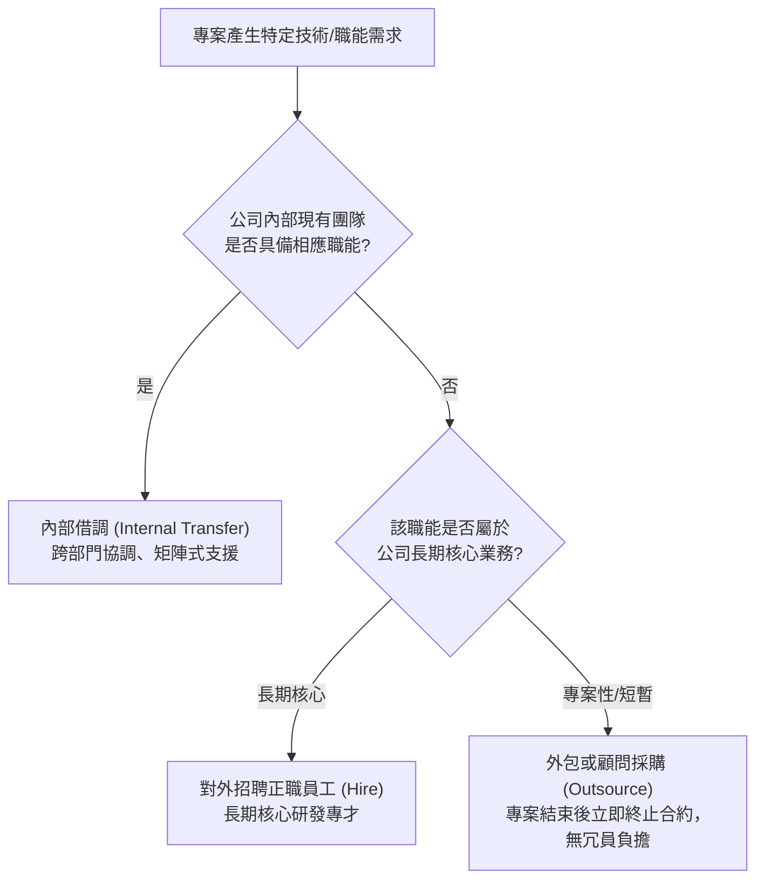
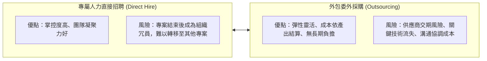

# 🛡️ PM-05-ORGANIZATION-OUTSOURCING 專案管理實務 Lesson 05：專案組織人力配置、職能矩陣與外包採購決策

> **課程主題**：專案組織架構（Organizational Structure）、人力資源配置、自製或外購（Make-or-Buy Analysis）與外包採購管理  
> **授課教授**：授課講師（專案管理授課教授）  
> **核心模組**：Resource Allocation, Skills Matrix, Staffing Acquisition, Make-or-Buy Decision, Outsourcing Risk  
> **學習目標**：掌握專案組織與職能矩陣之匹配原則，精確評估專屬人力招聘之後續閒置風險，並建立理性外包決策架構  
> **關聯文件**：[📄 完整原話逐字稿 (專案管理-05-組織人力配置職能矩陣與外包採購決策-proofread.md)](./專案管理-05-組織人力配置職能矩陣與外包採購決策-proofread.md)

---

## 🏛️ 專案人力資源取得途徑決策樹 (Staffing Decision Tree)

---

## ⚖️ 專案人員聘僱 vs. 外包採購權衡

---

## 🎯 核心重點整理 (Key Takeaways)

### 1. 專案組織能力盤點與對稱性分析
- **職能落差識別**：在專案啟動時，必須比對 WBS 工作包所需的技術能力與現有成員的技能矩陣（Skills Matrix）。
- **組織靈活性優先**：現代敏捷型企業應避免因為單一專案的需求而盲目擴張編制，優先考慮組織內調（Staff Reallocation）。

### 2. 「專案專聘」的高昂隱形成本
- **專案專聘的後遺症**：若專門為某一案子聘請特定專家，一旦該專案結案，若公司後續缺乏同類型專案接續，此專案聘任人員將陷入無案可做的閒置窘境，企業甚至面臨遣散或冗員成本。
- **解決方案**：短中期或非核心專用技術，應優先採取外包（Outsourcing）或顧問合作模式。

### 3. 外包採購合約管理的關鍵
- **明確驗收標準（SOW: Statement of Work）**：委外案必須具備高度量化之交付物清單與驗收規範，避免履約爭議。
- **里程碑分期撥款**：將外包付款進度與實機驗收點（Milestones）緊密綁定，有效牽引供應商進度與品質。
