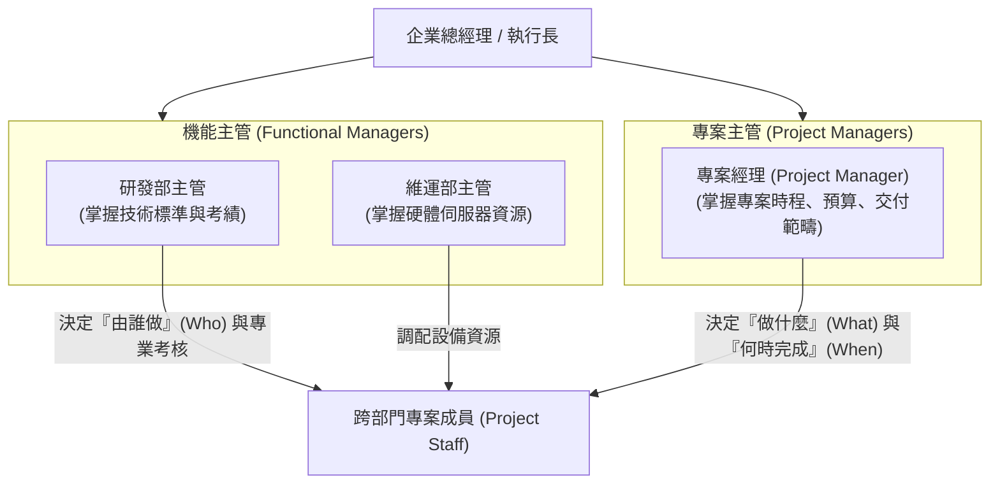

# 🛡️ PM-08-ROLE-DELEGATION-GOVERNANCE 專案管理實務 Lesson 08：專案角色授權、組織權責劃分與跨部門協調

> **課程主題**：專案治理架構（Project Governance）、角色授權、矩陣型組織權責劃分與跨部門資源協調  
> **授課教授**：授課講師（專案管理授課教授）  
> **核心模組**：Project Governance, Authority Delegation, Matrix Organization, RACI Matrix, Resource Conflict  
> **學習目標**：釐清弱矩陣、平衡矩陣與強矩陣組織中 PM 之授權邊界，建立透明之決策升級與授權層級體系  
> **關聯文件**：[📄 完整原話逐字稿 (專案管理-08-專案角色授權與組織權責矩陣劃分-proofread.md)](./專案管理-08-專案角色授權與組織權責矩陣劃分-proofread.md)

---

## 🏛️ 矩陣型組織架構中專案經理與機能主管權責邊界

---

## 🎯 核心重點整理 (Key Takeaways)

### 1. 專案角色的雙重報告線（Dual Reporting）
- **矩陣型組織挑戰**：專案成員同時向機能主管（Functional Manager）與專案經理（PM）報告，極易產生指令衝突。
- **權限清晰劃分**：PM 主掌專案工作範疇、時程與交付物；機能主管主掌人員專業訓練、薪酬考績與長期職涯分配。

### 2. 授權與責任落實
- **授權層級設計**：專案經理在預算與時程調整上應具備明確的自主核決權限，避免枝微末節的變更皆需向上請示而喪失專案敏捷度。
