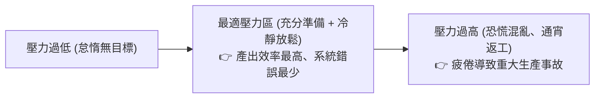

# 🛡️ PM-09-TEAM-PSYCHOLOGY-READINESS 專案管理實務 Lesson 09：專案團隊心理調適、聯考裝杯標哲學與成果驗收前瞻

> **課程主題**：專案團隊心理調適、驗收前壓力管理、個人專業適性發展與專案交付前預備度檢核  
> **授課教授**：授課講師（專案管理授課教授）  
> **核心模組**：Stress Management, Readiness Review, Career Diversity, Psychological Safety, Final Delivery  
> **學習目標**：掌握專案衝刺收尾期的團隊心理韌性建設，建立上線前的冷靜驗收心態並正確認知多元人才價值  
> **關聯文件**：[📄 完整原話逐字稿 (專案管理-09-專案團隊心理調適與成果驗收前瞻-proofread.md)](./專案管理-09-專案團隊心理調適與成果驗收前瞻-proofread.md)

---

## 🏛️ 專案收尾衝刺壓力與心理調適曲線 (Yerkes-Dodson 模型)

---

## 🎯 核心重點整理 (Key Takeaways)

### 1. 充足準備後的「放鬆哲學」
- **聯考裝杯標比喻**：專案上線前最後關頭，最重要的不再是臨時盲目寫新功能，而是「放鬆心情、檢查清單、確保既有架構穩定運作」。慌亂改動往往是生產事故的元凶。
- **心理韌性**：專案經理的從容定見是穩定整個團隊軍心的核心錨點。

### 2. 人才多樣性與實務生存力
- **學業成績 vs. 商業實踐**：會讀書的人適合走純學術或研究型道路；而能在複雜商業環境中賺錢破局的，往往是具備高情商、人脈整合與業務膽識的成員。專案團隊必須包容各具所長的多元人才。
