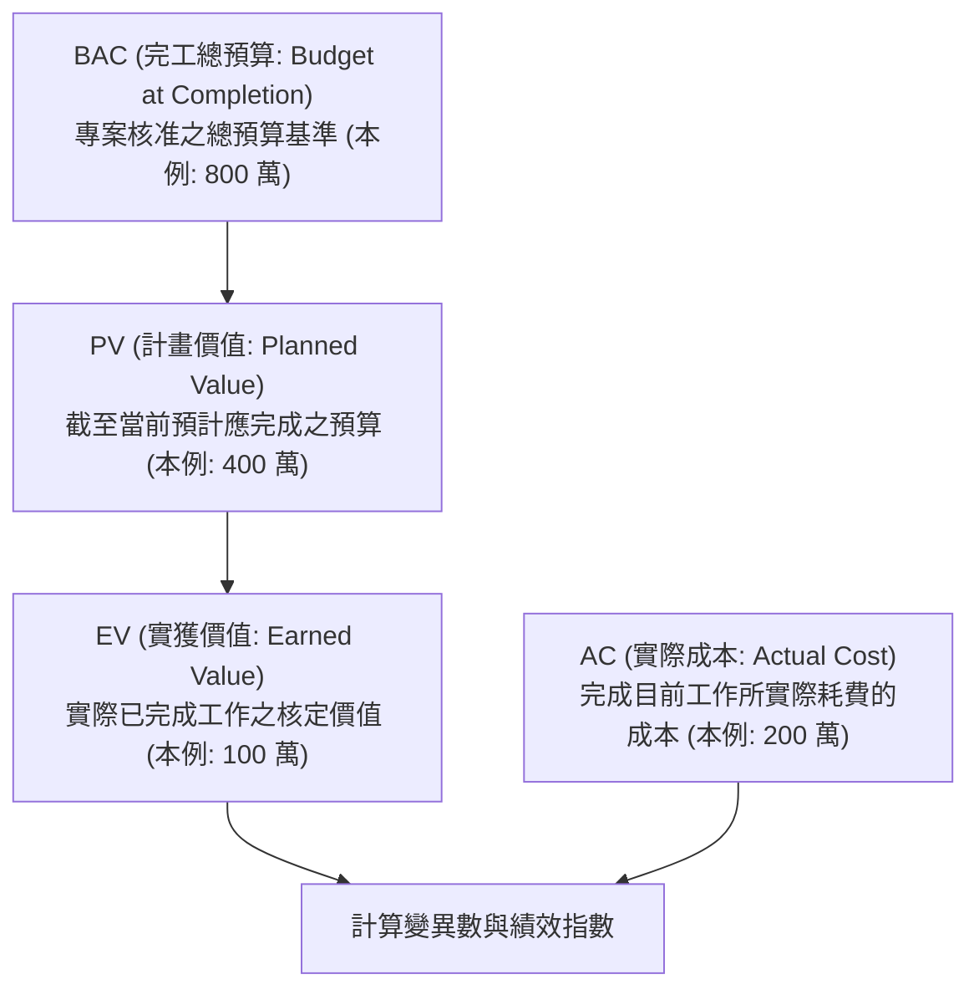

# 🛡️ PM-11-QUALITY-EVM-LARGE-PROJECTS 專案管理實務 Lesson 11：專案品質度量、EVM 指標精確計算與大型工程驗收

> **課程主題**：專案品質管理（Quality Management）、實獲值（EVM）核心公式計算、三重限制與大型標竿工程驗收評估  
> **授課教授**：授課講師（專案管理授課教授）  
> **核心模組**：Earned Value Management, EVM Metrics, BAC, PV, EV, AC, Triple Constraints, Large-Scale Projects  
> **學習目標**：精熟 EVM 成本與時程變異數及績效指標（CV, SV, CPI, SPI）之計算，掌握大型工程（如 101 大樓、捷運）評估驗收標準  
> **關聯文件**：[📄 完整原話逐字稿 (專案管理-11-專案品質度量EVM指標計算與大型工程驗收-proofread.md)](./專案管理-11-專案品質度量EVM指標計算與大型工程驗收-proofread.md)

---

## 🏛️ 實獲值管理 (EVM) 核心四大基礎變數

---

## 📊 課堂 EVM 算例深度解析 (截至第二年底)

| 指標代號 | 指標名稱 | 計算公式 | 數值計算 | 狀態解讀 |
| :--- | :--- | :--- | :--- | :--- |
| **CV** | 成本差異 (Cost Variance) | $EV - AC$ | $100 - 200 = -100$ 萬 | **🔴 成本嚴重超支 (Over Budget)** |
| **SV** | 時程差異 (Schedule Variance) | $EV - PV$ | $100 - 400 = -300$ 萬 | **🔴 進度嚴重落後 (Behind Schedule)** |
| **CPI** | 成本績效指標 (Cost Performance Index) | $EV / AC$ | $100 / 200 = 0.5$ | **每花 1 元僅產生 0.5 元價值** |
| **SPI** | 時程績效指標 (Schedule Performance Index) | $EV / PV$ | $100 / 400 = 0.25$ | **實際進度僅為預期之 25%** |

---

## 🎯 核心重點整理 (Key Takeaways)

### 1. EVM 指標判讀心法
- **變異數小於 0 為警訊**：$CV < 0$ 代表成本超支；$SV < 0$ 代表進度落後。
- **指標小於 1.0 為劣質**：$CPI < 1.0$ 代表花錢效率不佳；$SPI < 1.0$ 代表執行進度落後。本課堂算例中 $CPI=0.5, SPI=0.25$，顯示該專案處於極端危機狀態，必須進行全面範疇縮減或重組。

### 2. 大型專案的獨立評估機制
- **台北 101 與捷運工程案例**：大型公共或高階建築專案，驗收階段必須委託獨立公正的第三方外部評估專家，依據範疇、時間、成本與技術規格四大要點出具正式評估報告書。

### 3. 「落實執行」高於一切
- 專案管理並非僅是繪製美觀甘特圖或填寫表格，最關鍵的核心在於「落實執行（Execution & Implementation）」。
