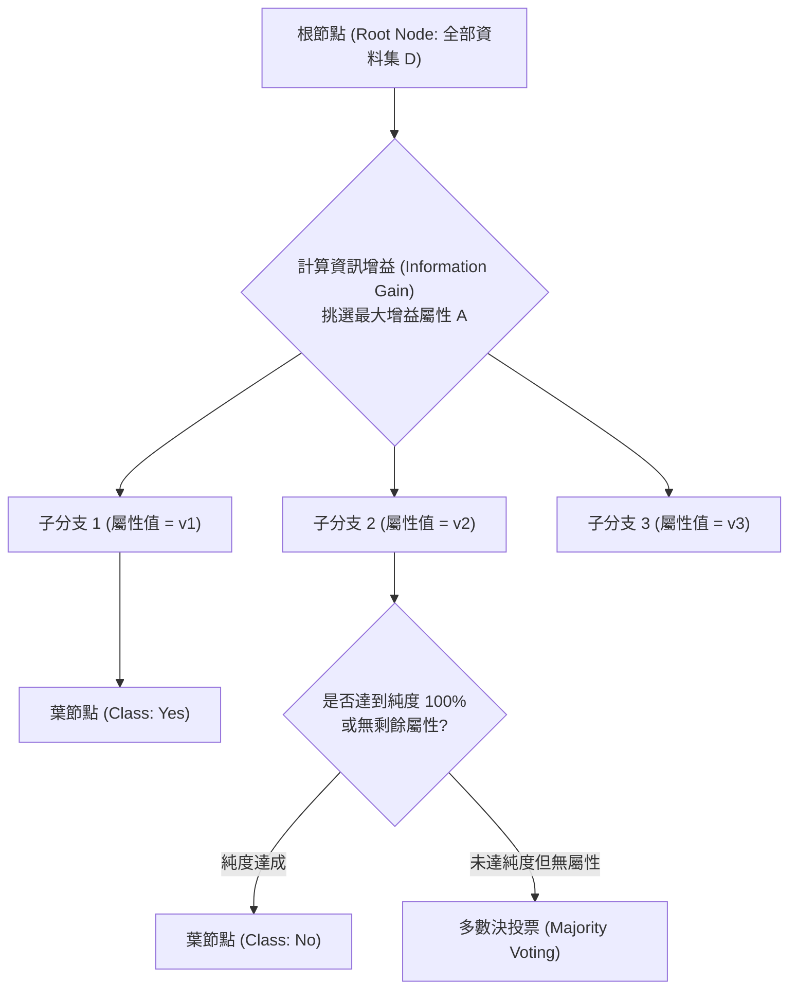
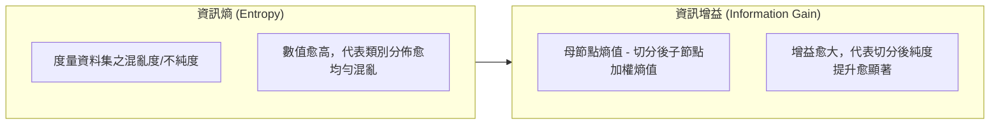

# 🛡️ ML-01-DECISION-TREE-ID3 機器學習實務 Lesson 01：監督式學習分類問題定義、決策樹演算法 ID3 與資訊增益

> **課程主題**：機器學習監督式分類模型、決策樹（Decision Tree）、資訊熵（Entropy）與資訊增益（Information Gain）  
> **授課教授**：授課講師（資訊工程授課教授）  
> **核心模組**：Classification, Decision Tree, Entropy, Information Gain, ID3 Algorithm, Majority Voting  
> **學習目標**：理解監督式學習資料表示法，掌握 ID3 決策樹之節點屬性切分數學原理與停止分裂準則  
> **關聯文件**：[📄 完整原話逐字稿 (機器學習-01-監督式學習分類與決策樹演算法ID3-proofread.md)](./機器學習-01-監督式學習分類與決策樹演算法ID3-proofread.md)

---

## 🏛️ 決策樹 (Decision Tree) 遞迴分裂架構

---

## 📊 決策樹建構與資料切分評估指標

---

## 🎯 核心重點整理 (Key Takeaways)

### 1. 監督式分類問題的數學定義
- **資料集表徵**：由 $N$ 筆記錄（Records）組成，每筆記錄包含一組特徵屬性向量 $\mathbf{x} = (x_1, x_2, \dots, x_d)$ 與一個已知的類別標籤（Class Label）$y \in \{C_1, C_2, \dots, C_k\}$。
- **目標**：從訓練資料集中學習出映射函數 $f(\mathbf{x}) 	o y$，使模型對未見過的測試資料具備準確泛化預測能力。

### 2. 資訊熵 (Entropy) 與資訊增益 (Information Gain) 公式
- **資訊熵（Entropy）**：
  $$Entropy(D) = - \sum_{i=1}^{k} p_i \log_2(p_i)$$
  其中 $p_i$ 為資料集 $D$ 中屬於類別 $C_i$ 之機率樣本比例。若所有樣本均屬同一類別，則 $Entropy(D) = 0$（完全純淨）。
- **資訊增益（Information Gain, ID3 演算法核心）**：
  $$Gain(D, A) = Entropy(D) - \sum_{v \in Values(A)} rac{|D_v|}{|D|} Entropy(D_v)$$
  ID3 演算法於每個節點遍歷所有可用屬性 $A$，選取能帶來最大 $Gain(D, A)$ 之屬性作為當前切分條件。

### 3. 決策樹遞迴停止條件
- **完全純淨**：當前節點的所有樣本均屬於同一類別標籤，直接生成葉節點（Leaf Node）。
- **屬性耗盡**：所有特徵屬性皆已被切分使用完畢，但樣本類別仍不純。此時採行**多數決投票（Majority Voting）**，將節點標註為出現頻率最高之類別。
- **空子節點**：某個屬性取值在訓練集中無任何對應樣本，將父節點的多數類別賦予該葉節點。
