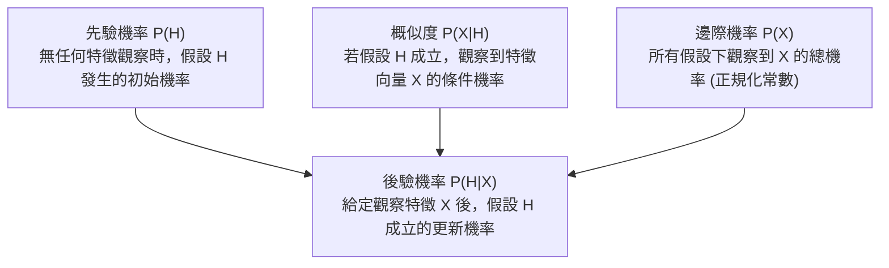
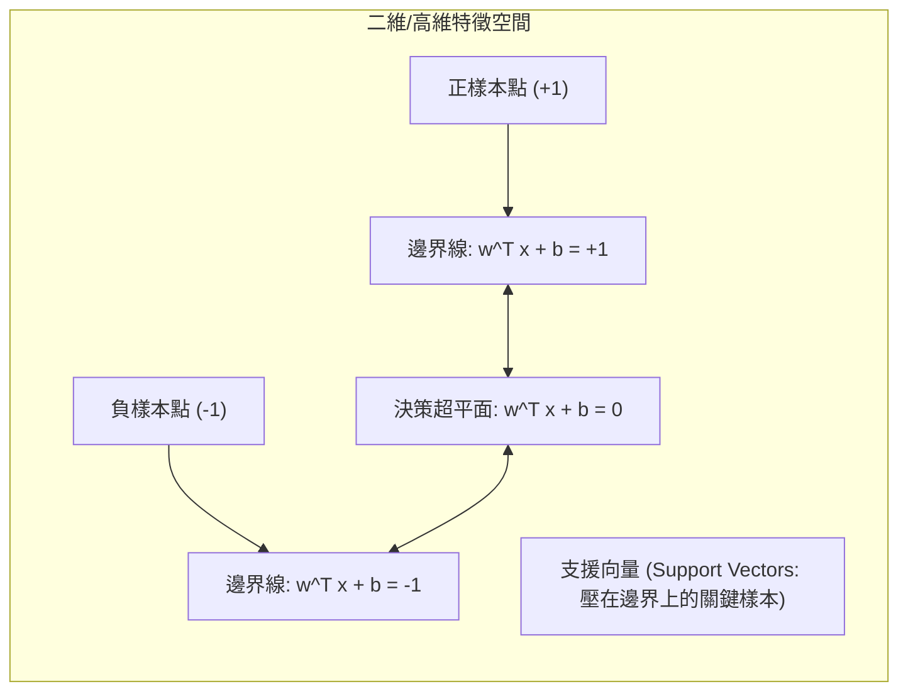

# 🛡️ ML-02-NAIVE-BAYES-SVM 機器學習實務 Lesson 02：單純貝氏分類器 Naive Bayes 與支援向量機 SVM 原理

> **課程主題**：貝氏定理、單純貝氏分類器（Naive Bayes Classifier）、最大後驗機率（MAP）與 SVM 最大邊界超平面  
> **授課教授**：授課講師（資訊工程授課教授）  
> **核心模組**：Bayes Theorem, Prior & Posterior Probability, Likelihood, Naive Bayes, Conditional Independence, SVM  
> **學習目標**：精熟貝氏機率模型推論架構，理解特徵條件獨立性簡化假設，並建立支援向量機最大間距（Margin）之幾何概念  
> **關聯文件**：[📄 完整原話逐字稿 (機器學習-02-貝氏分類器與支援向量機SVM原理-proofread.md)](./機器學習-02-貝氏分類器與支援向量機SVM原理-proofread.md)

---

## 🏛️ 貝氏定理機率推論架構 (Bayesian Inference)

---

## ⚖️ 支援向量機 (SVM) 最大邊界超平面 (Maximum Margin Hyperplane)

---

## 🎯 核心重點整理 (Key Takeaways)

### 1. 貝氏定理數學推導與組成成分
- **基本公式**：
  $$P(H|X) = rac{P(X|H) P(H)}{P(X)}$$
  - **後驗機率 $P(H|X)$**：在已知特徵樣本 $X$ 發生的條件下，假設 $H$ 成立的機率。
  - **先驗機率 $P(H)$**：領域知識或訓練集中假設 $H$ 出現的基礎頻率。
  - **概似度（Likelihood）$P(X|H)$**：假設 $H$ 為真時，產生特徵樣本 $X$ 的機率。
  - **證據（Evidence）$P(X)$**：$\sum_{h} P(X|h)P(h)$，作為常數正規化因子。

### 2. 單純貝氏分類器 (Naive Bayes) 的關鍵假設
- **條件獨立性假設（Conditional Independence Assumption）**：
  假設給定類別標籤 $C$ 後，各個特徵屬性 $x_1, x_2, \dots, x_d$ 相互獨立：
  $$P(X|C) = P(x_1, x_2, \dots, x_d | C) = \prod_{i=1}^{d} P(x_i | C)$$
- **最大後驗機率分類決策（MAP Decision Rule）**：
  $$\hat{y} = rg\max_{c \in \mathcal{C}} P(C=c) \prod_{i=1}^{d} P(x_i | C=c)$$
  此假設大幅降低了計算複雜度，避免了維度災難（Curse of Dimensionality）。

### 3. 支援向量機 (SVM) 核心理念
- **最大間距超平面（Maximum Margin Hyperplane）**：在所有可完全分開正負樣本的超平面中，尋找使得支援向量（Support Vectors）與超平面距離最大化的最佳決策邊界。
- **強韌性**：僅由少數壓在邊界上的支援向量決定分類超平面，對遠離邊界的雜訊資料具備高度容錯性。
