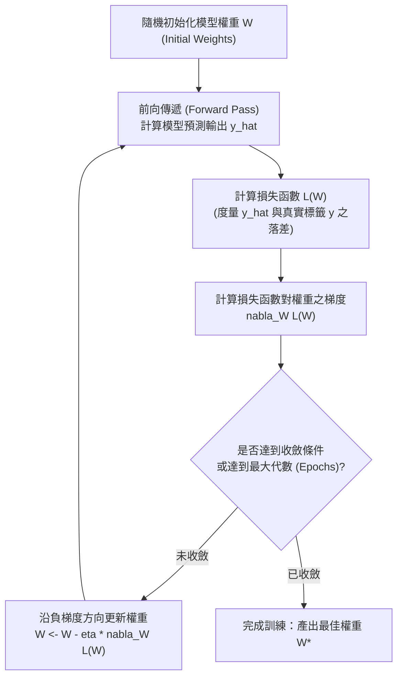
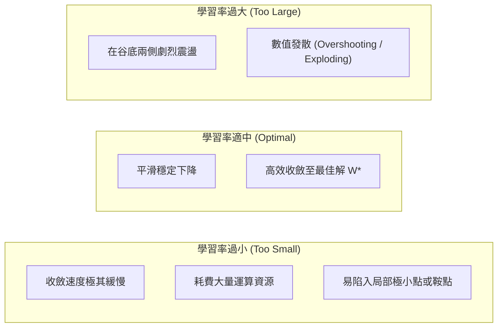

# 🛡️ ML-04-LOSS-GRADIENT-DESCENT 機器學習實務 Lesson 04：特徵萃取、損失函數與梯度下降法模型最佳化

> **課程主題**：特徵萃取機制、損失函數（Loss Function）、最佳化求解與梯度下降演算法（Gradient Descent）  
> **授課教授**：授課講師（資訊工程授課教授）  
> **核心模組**：Feature Representation, Loss Function, Convex Optimization, Gradient Descent, Learning Rate  
> **學習目標**：掌握損失函數度量預測誤差之機制，精熟梯度下降法沿著斜率反方向更新權重 $W$ 尋找全域/局部最佳解  
> **關聯文件**：[📄 完整原話逐字稿 (機器學習-04-特徵萃取與梯度下降損失函數最佳化-proofread.md)](./機器學習-04-特徵萃取與梯度下降損失函數最佳化-proofread.md)

---

## 🏛️ 損失函數曲面與梯度下降最佳化迭代流程

---

## 📉 學習率 (Learning Rate, eta) 大小之收斂特性比較

---

## 🎯 核心重點整理 (Key Takeaways)

### 1. 損失函數 (Loss Function) 的核心職責
- **度量差距**：損失函數 $L(W)$ 衡量神經網路當前預測結果 $\hat{y}$ 與真實世界地面真相（Ground Truth）$y$ 之間的誤差。
- **常見型式**：
  - **均方誤差（Mean Squared Error, MSE）**（用於迴歸）：
    $$L_{MSE}(W) = rac{1}{N} \sum_{i=1}^{N} (y_i - \hat{y}_i)^2$$
  - **交叉熵損失（Cross-Entropy Loss）**（用於多類別分類）：
    $$L_{CE}(W) = - \sum_{i=1}^{N} \sum_{c=1}^{K} y_{i,c} \log(\hat{y}_{i,c})$$

### 2. 梯度下降演算法更新規則
- **核心更新公式**：
  $$W^{(t+1)} = W^{(t)} - \eta 
abla_W L(W^{(t)})$$
  其中 $
abla_W L(W) = rac{\partial L}{\partial W}$ 為損失函數的一階偏導數（斜率向量），$\eta > 0$ 為學習率（Learning Rate）。
- **物理意涵**：負梯度方向為函數值局部下降最快的方向。模型沿著負梯度方向一步步滾落至誤差曲面的低谷。

### 3. 特徵萃取（Feature Extraction）的深層轉換本質
- 隱藏層的實質任務是將原本在低維或非線性不可分的原始資料空間，經過逐層非線性映射，變換至高維度特徵空間，使得最終的輸出層能夠以最簡單的線性超平面將資料完美分類。
