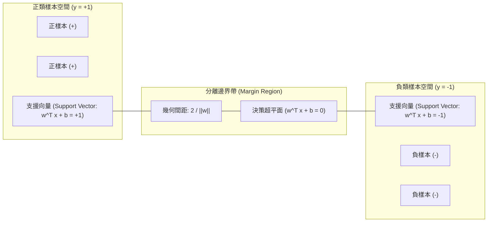
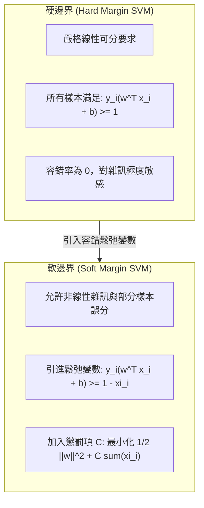

# 🛡️ ML-05-SVM-HYPERPLANE-SOFT-MARGIN 機器學習實務 Lesson 05：貝氏信念網路、支援向量機 SVM 最大間距超平面與軟邊界最佳化

> **課程主題**：貝氏信念網路（BBN）、支援向量機（SVM）、最大間距超平面（Maximum Margin Hyperplane）與軟邊界（Soft Margin）最佳化  
> **授課教授**：授課講師（資訊工程授課教授）  
> **核心模組**：Classification, Bayesian Belief Network, SVM, Hyperplane, Hard Margin, Soft Margin, Slack Variables  
> **學習目標**：掌握貝氏機率模型推論複雜度與 Baseline 定位，深入理解 SVM 幾何間距公式推導，並明辨硬邊界與軟邊界之容錯損失函數機制  
> **關聯文件**：[📄 完整原話逐字稿 (機器學習-05-支援向量機SVM最大間距超平面與軟邊界最佳化-proofread.md)](./機器學習-05-支援向量機SVM最大間距超平面與軟邊界最佳化-proofread.md)

---

## 🏛️ 支援向量機 (SVM) 線性可分與最大間距架構

---

## 📊 硬邊界 (Hard Margin) vs. 軟邊界 (Soft Margin) 比較

---

## 🎯 核心重點整理 (Key Takeaways)

### 1. 貝氏分類器與貝氏信念網路 (Bayesian Belief Networks) 之定位
- **計算複雜度與專家先驗**：傳統單純貝氏假設屬性條件獨立，但在真實複雜情境下屬性往往相依。貝氏信念網路透過有向無環圖（DAG）表達變數條件機率，但因需大量領域專家後驗機率推估，實務工程代價極高。
- **學術與工程基準線（Baseline）**：現代機器學習與深度學習論文中，貝氏分類器經常作為不可或缺的 Baseline 模型，用於客觀驗證新演算法之性能提升幅度。

### 2. 支援向量機幾何最大間距 (Maximum Margin) 推導
- **超平面定義**：空間中決策平面由 $\mathbf{w}^T \mathbf{x} + b = 0$ 決定，其中 $\mathbf{w}$ 為法向量（Normal Vector），$b$ 為偏差位移量（Bias）。
- **間距大小**：兩側邊界線分別為 $\mathbf{w}^T \mathbf{x} + b = +1$ 與 $\mathbf{w}^T \mathbf{x} + b = -1$，兩平行超平面間的幾何邊界距離為：
  $$\text{Margin} = \frac{2}{\|\mathbf{w}\|}$$
- **目標函數**：最大化間距等價於在約束條件 $y_i(\mathbf{w}^T \mathbf{x}_i + b) \ge 1$ 下，最小化 $\frac{1}{2}\|\mathbf{w}\|^2$。

### 3. 軟邊界 (Soft Margin) 與鬆弛變數 (Slack Variables)
- **鬆弛變數引進**：真實資料集中常存在雜訊或交疊樣本，無法嚴格線性可分。為每筆樣本引入鬆弛變數 $\xi_i \ge 0$，放寬邊界條件為：
  $$y_i(\mathbf{w}^T \mathbf{x}_i + b) \ge 1 - \xi_i$$
- **懲罰參數 $C$ 權衡**：目標函數調整為：
  $$\min_{\mathbf{w}, b, \boldsymbol{\xi}} \frac{1}{2}\|\mathbf{w}\|^2 + C \sum_{i=1}^{N} \xi_i$$
  $C$ 越大代表對錯誤分類懲罰越重（趨近硬邊界）；$C$ 越小則允許更多容錯邊界，提高對雜訊的泛化容忍度。
