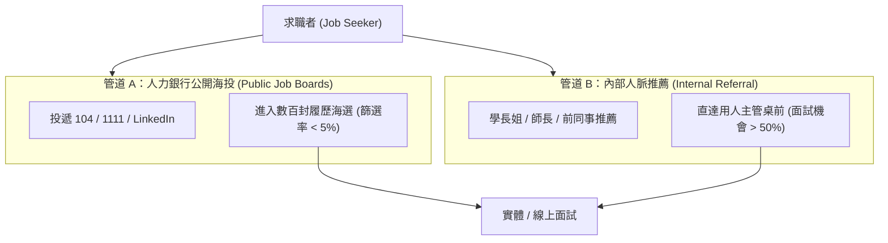
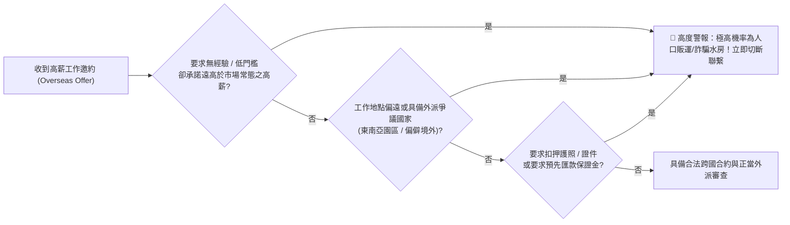

# 🛡️ CAREER-01-POSITIONING-NETWORKING-SAFETY 職涯發展與就業輔導 Lesson 01：求職自我優勢定位、人脈推薦與海外求職防詐實務

> **課程主題**：求職自我定位、專業軟實力展現、內部人脈推薦優勢、職場時間管理與海外高薪求職防詐  
> **授課教授**：授課講師（職涯就業輔導顧問）  
> **核心模組**：Career Positioning, Referral Networking, Time Management, Anti-Fraud Awareness, Job Registration  
> **學習目標**：釐清個人專業優勢與職務適配性，掌握內部推薦求職管道，並建立辨識海外高薪外派詐騙之防禦警覺  
> **關聯文件**：[📄 完整原話逐字稿 (職涯發展-01-求職自我定位人脈媒合與海外求職防詐實務-proofread.md)](./職涯發展-01-求職自我定位人脈媒合與海外求職防詐實務-proofread.md)

---

## 🏛️ 多軌求職管道轉換與媒合成功率比較

---

## 🛡️ 海外高薪求職陷阱特徵雷達

---

## 🎯 核心重點整理 (Key Takeaways)

### 1. 求職自我定位與「非你莫屬」效應
- **客製化適配（Job Matching）**：切忌一份通用履歷海投到底。應針對目標企業的職務描述（Job Description, JD）逐條對齊，展現出「你的技能正是為此職位量身打造」。
- **內部推薦（Referral）的破局力量**：人脈推薦能大幅降低企業人資的信任成本與背景調查風險，是進入優質企業最具效率的捷徑。

### 2. 職場時間管理與承諾紀律
- **日程排程優先度**：時間管理能力決定了一個人的專業上限。一旦行程預先敲定，應堅守承諾；避免因臨時邀約打亂原本專案節奏。

### 3. 海外求職防詐安全防線
- **海外求職詐騙態樣**：除了眾所皆知的特定東南亞園區，歐洲非典型偏遠據點亦曾查獲詐騙集團洗錢水房。
- **自保金律**：絕不可將護照、身分證件交由非官方機構扣押；凡未經正式專業筆面試即許諾高薪出國者，均屬高風險陷阱。
