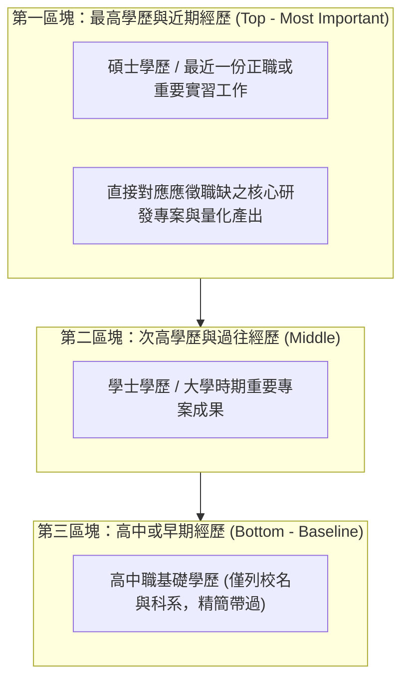

# 🛡️ CAREER-03-REVERSE-CHRONO-INTERVIEW 職涯發展與就業輔導 Lesson 03：學經歷倒敘法撰寫規範與面試應對實戰技巧

> **課程主題**：學經歷倒敘法（Reverse Chronological Order）、職務內容精準對焦、誠信回答原則與面試提問策略  
> **授課教授**：授課講師（職涯就業輔導顧問）  
> **核心模組**：Reverse Chronology, Resume Writing Standards, Behavioral Interview, Fact-Based Answering  
> **學習目標**：熟練運用倒敘法將最具價值的最高學經歷置頂展現，掌握面試誠信應對底線與向主管主動提問之加分技巧  
> **關聯文件**：[📄 完整原話逐字稿 (職涯發展-03-學經歷倒敘法撰寫規範與面試應對實戰技巧-proofread.md)](./職涯發展-03-學經歷倒敘法撰寫規範與面試應對實戰技巧-proofread.md)

---

## 🏛️ 履歷學經歷「倒敘法」標準結構

---

## 🎯 核心重點整理 (Key Takeaways)

### 1. 學經歷撰寫的「倒敘法」金律
- **最高優先**：履歷表最上方必須是**最新的最高學歷與最近的工作經歷**。人資最關心你當前或近期的技能成熟度，切忌依時間順序從高中或國小開始由前往後寫。
- **慘痛案例借鏡**：部分求職者未採倒敘法，將高中甚至國中學歷排在最顯眼的第一行，將碩士學位淹沒在底端，極易在初篩時遭誤判淘汰。

### 2. 應徵項目分類與職務對焦
- **精確對位職缺內容**：面試前務必徹底熟讀目標職缺的工作內容（Responsibilities），並在履歷中將專案技能分門別類，切忌對應徵職位之具體工作一無所知。

### 3. 面試應對的三大誠信底線
- **依實質事實回答（Fact-Based）**：知之為知之，不知為不知。技術面試中若遇到未接觸過的領域，坦承說明並展現學習路徑，切忌胡亂編造；一旦被資深考官追問細節而崩盤，將直接喪失錄取機會。
- **雙向提問的藝術**：面試尾聲主管詢問「你有什麼問題想問」時，應主動提出關於團隊研發挑戰、專案技術堆疊或部門願景之深度問題，展現強烈的入職企圖心。
