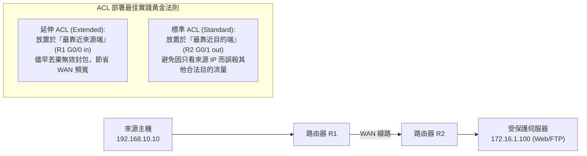

# 🛡️ CCNA-DISC-18 Cisco CCNA 1 Lab Discovery 18：標準 ACL vs 延伸 ACL 實機配置、命名清單與介面套用

> **課程主題**：Cisco IOS 存取控制清單（ACL）實機配置拓撲與精確過濾實戰  
> **授課講師**：授課講師（資安與網路認證原廠認證講師）  
> **核心模組**：Cisco CCNA 1 Lab Discovery: Access Control Lists (ACLs)  
> **學習目標**：掌握標準 ACL 與延伸 ACL 語法、放置位置黃金法則及 `ip access-group` 套用  
> **關聯文件**：[📄 完整原話逐字稿 (CCNA1-Lab-Discovery18-標準與延伸ACL配置-proofread.md)](./CCNA1-Lab-Discovery18-標準與延伸ACL配置-proofread.md)

---

## 🏛️ 核心架構與概念流轉圖

---

## 🔬 技術精華與核心考點解析

### 標準 ACL vs. 延伸 ACL 關鍵差異

- 標準 ACL（編號 1-99、1300-1999）：僅能依據『來源 IP 位址』進行比對過濾。
- 延伸 ACL（編號 100-199、2000-2699）：可依據協定（IP/TCP/UDP/ICMP）、來源 IP、目的 IP、來源 Port、目的 Port（如 eq 80, eq 443）進行多維度精準過濾。

### 放置位置黃金法則

- 延伸 ACL 靠近來源端（Close to the source）：在封包進入網路的第一線直接阻擋，避免浪費內部骨幹與 WAN 頻寬。
- 標準 ACL 靠近目的端（Close to the destination）：因為標準 ACL 只檢查來源 IP，若放太靠近來源端，會導致該主機前往所有其他網段的流量全被阻斷！

### 隱含拒絕（Implicit Deny Any）

- 所有 Cisco ACL 規則最後一條預設皆隱含 `deny ip any any`，因此清單內若無至少一條 `permit` 規則，所有流量將全數被擋下。

---

## 💡 關鍵總結與考試應對重點

1. **考試常考：標準 ACL 放哪裡？（靠近目的端）；延伸 ACL 放哪裡？（靠近來源端）。**
1. **套用指令：進入介面模式輸入 `ip access-group <ACL號碼/名稱> <in|out>`。**
