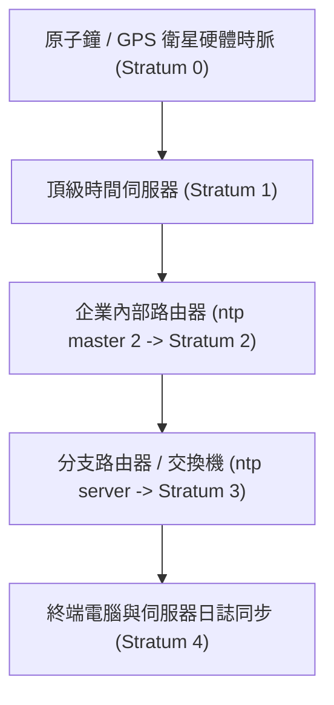

# 🛡️ CCNA-Lab-Disc21 Cisco CCNA 1 Lab Discovery 21：NTP網路時間協定階層配置實作

> **課程主題**：網路時間協定 NTP 實作：Stratum 階層、ntp master 宣告與用戶端同步驗證  
> **授課講師**：授課講師（資安與網路認證原廠認證講師）  
> **核心模組**：Cisco CCNA 1 Lab Discovery 21: Configuring NTP Services  
> **學習目標**：掌握 NTP UDP 123 埠、配置路由器擔任 NTP Master (Stratum 2) 及客戶端校時  
> **關聯文件**：[📄 完整原話逐字稿 (CCNA1-Lab-Discovery21-NTP網路時間協定階層配置實作-proofread.md)](./CCNA1-Lab-Discovery21-NTP網路時間協定階層配置實作-proofread.md)

---

## 🏛️ 核心架構與概念流轉圖



---

## 🔬 技術精華與核心考點解析

### 1. NTP 配置指令
```cisco
! 伺服器端宣告 (設定為 Stratum 2 階層)
ntp master 2

! 客戶端指向伺服器
ntp server 10.3.1.100

! 驗證指令
show ntp status
show ntp associations
```

### 2. Stratum 階層意義
- **Stratum 0**：高精密度外部硬體參考時脈（如 GPS、銫原子鐘）。
- **Stratum 1**：直接連接 Stratum 0 硬體的伺服器。
- **Stratum 2 ~ 15**：透過網路逐層同步之節點，數字越大精準度遞減。
- **Stratum 16**：代表時脈未同步，無法提供有效時間服務。

---

## 💡 關鍵總結與考試應對重點

1. **資安考點：全網時間同步（NTP）是資安事件調查與 SIEM 記錄日誌關聯分析的最關鍵基礎，若時間錯亂則 Log 喪失法庭鑑識效力！**
2. **協定與埠號：NTP 使用 UDP Port 123。**
