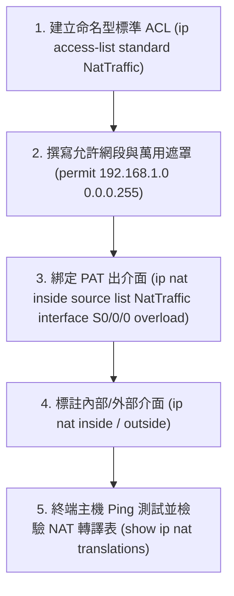

# 🛡️ CCNA-Lab-Fastlab09 Cisco CCNA 1 Lab Fastlab 09：PAT流量控制與ACL萬用遮罩整合演練

> **課程主題**：Cisco Fastlab 09：命名型 ACL 搭配 PAT 轉譯流量控制綜合實作演練  
> **授課講師**：授課講師（資安與網路認證原廠認證講師）  
> **核心模組**：Cisco CCNA 1 Lab Fastlab 09: PAT & Wildcard Mask Integration  
> **學習目標**：依據實驗規範精確建立 Named ACL、指派萬用遮罩並將其套用於 PAT 出介面  
> **關聯文件**：[📄 完整原話逐字稿 (CCNA1-Lab-Fastlab09-PAT流量控制與ACL萬用遮罩整合演練-proofread.md)](./CCNA1-Lab-Fastlab09-PAT流量控制與ACL萬用遮罩整合演練-proofread.md)

---

## 🏛️ 核心架構與概念流轉圖



---

## 🔬 技術精華與核心考點解析

### 1. 實驗關鍵設定指令
```cisco
! 建立命名型標準 ACL (名稱必須區分大小寫且完全符合題目規範)
ip access-list standard NatTraffic
 permit 192.168.1.0 0.0.0.255
 exit

! 啟用 PAT (Overload)
ip nat inside source list NatTraffic interface GigabitEthernet0/1 overload

! 介面設定
interface GigabitEthernet0/0
 ip nat inside
interface GigabitEthernet0/1
 ip nat outside
```

---

## 💡 關鍵總結與考試應對重點

1. **命名大小寫考點：在 Cisco IOS 中，命名型 ACL 的名稱（Name）具有大小寫敏感性（Case-Sensitive），題目要求 `NatTraffic` 若打成 `nattraffic` 會被判 0 分！**
2. **驗證方式：使用 `show ip access-lists` 可直接檢視該清單匹配之封包 Matches 計數。**
