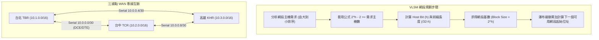

# 🛡️ CCNA-293-300 Cisco CCNA 1 Lesson 頁293~300：VLSM子網切割作業解析與路由表運作原理

> **課程主題**：VLSM 可變長度子網路遮罩實務計算與路由器直連/靜態路由架構  
> **授課講師**：授課講師（資安與網路認證原廠認證講師）  
> **核心模組**：Cisco CCNA 1 Chapter 8: Subnetting & Routing Principles  
> **學習目標**：掌握 2^h - 2 子網規劃法則、瀑布級聯分配、三據點 WAN 互聯拓撲及 Serial 介面時脈設定  
> **關聯文件**：[📄 完整原話逐字稿 (CCNA1-Lesson-293-300-VLSM子網切割與路由表運作原理-proofread.md)](./CCNA1-Lesson-293-300-VLSM子網切割與路由表運作原理-proofread.md)

---

## 🏛️ 核心架構與概念流轉圖

---

## 🔬 技術精華與核心考點解析

### 1. VLSM 核心公式與計算準則
- **主機位元公式**：2^h - 2 >= 需求主機數（扣除網路位址與廣播位址）。
- **分配原則**：必須由需求量最大的網段開始切割分配，使用基數累加求下一網段起始位址，嚴禁重複使用已分配之位址區段。
- **點對點專線**：一律採用 /30（Host bits = 2，可用位址恰為 2 個，無位址浪費）。

### 2. 路由表直連路由特性
- **代碼 C (Connected)**：路由器直接連接之網段，僅記載出介面，無下一跳（Next-Hop）。
- **代碼 L (Local)**：本地介面分配之單一位址，遮罩固定為 /32。
- **非直連網段**：必須透過靜態路由或動態路由協定手動新增，且必須具備「雙向路由（有去有回）」才能建立正常通訊。

### 3. Serial 專線介面與時脈控制
- **DCE (Data Communications Equipment)**：母頭線路，負責提供時脈信號，必須配置 `clock rate <speed>` 指令。
- **DTE (Data Terminal Equipment)**：公頭線路，純接收時脈，僅需被動同步。
- **狀態判定**：
  - `Line down, protocol down`：未接線、對端關機或未收到 keepalive。
  - `Line up, protocol down`：底層訊號正常，但第二層封裝協定不一致（如 HDLC vs. PPP）。
  - `Line up, protocol up`：介面與鏈路完全正常。

---

## 💡 關鍵總結與考試應對重點

1. **考試重點：路由器收到封包若該網段非直連且無路由表紀錄，預設直接丟棄（Drop），不會主動轉發。**
2. **實務關鍵：測試連線不通時，70% 以上的原因是回程路徑缺乏路由（有去無回），排錯務必雙向追查。**
3. **指令速查：使用 `show controllers serial <port>` 可快速辨識該介面為 DCE 還是 DTE。**
