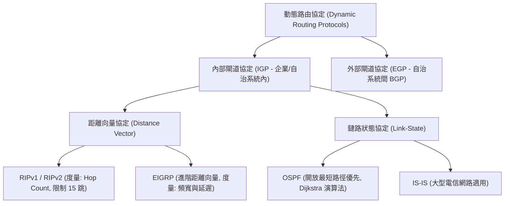

# 🛡️ CCNA-330-339 Cisco CCNA 1 Lesson 頁330~339：動態路由協定分類與距離向量協定RIP運作機制

> **課程主題**：內部閘道協定（IGP）分類體系、距離向量運作原理與 RIP 協定特性  
> **授課講師**：授課講師（資安與網路認證原廠認證講師）  
> **核心模組**：Cisco CCNA 1 Chapter 8: Dynamic Routing Protocols & RIP  
> **學習目標**：理解收斂（Convergence）、掌握 Distance Vector vs. Link-State 演算法本質及 RIP 限制  
> **關聯文件**：[📄 完整原話逐字稿 (CCNA1-Lesson-330-339-動態路由協定分類與距離向量RIP運作機制-proofread.md)](./CCNA1-Lesson-330-339-動態路由協定分類與距離向量RIP運作機制-proofread.md)

---

## 🏛️ 核心架構與概念流轉圖

---

## 🔬 技術精華與核心考點解析

### 1. 距離向量協定核心特徵
- **以鄰居傳聞為依據（Routing by Rumor）**：路由器並不掌握全網完整拓撲圖，僅依賴直接相鄰節點定時傳遞之路由表資訊進行累加。
- **收斂（Convergence）時間**：網路拓撲變動時，全體路由器達成一致路由資訊所需之時間；距離向量協定收斂速度較鏈路狀態協定緩慢。

### 2. RIP 協定限制與考點
- **度量標準（Metric）**：僅以**跳躍次數（Hop Count）**計算，無視鏈路頻寬高低（10 Gbps 與 64 Kbps 線路在 RIP 眼中等同 1 跳）。
- **最大跳數限制**：最大有效跳數為 **15 跳**，若跳數達到 **16 跳** 即標記為不可達（Unreachable），防止路由迴圈無限遞增。

---

## 💡 關鍵總結與考試應對重點

1. **考試常考：RIP 的最大有效跳數是 15 跳，16 跳代表不可到達。**
2. **協定對比：RIP 使用廣播（RIPv1）或群播（RIPv2 `224.0.0.9`）每 30 秒定期發送完整路由表，開銷龐大；OSPF 僅在拓撲變更時觸發更新。**
