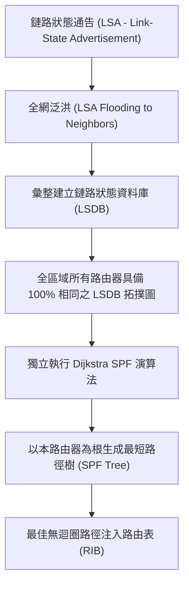

# 🛡️ CCNA-340-347 Cisco CCNA 1 Lesson 頁340~347：鏈路狀態路由協定與OSPF演算法核心架構

> **課程主題**：鏈路狀態路由（Link-State Routing）與 OSPF 協定核心機制  
> **授課講師**：授課講師（資安與網路認證原廠認證講師）  
> **核心模組**：Cisco CCNA 1 Chapter 9: OSPF Fundamentals & Link-State  
> **學習目標**：理解 LSA 泛洪、掌握 LSDB 資料庫同步原理及 SPF 最短路徑優先演算法  
> **關聯文件**：[📄 完整原話逐字稿 (CCNA1-Lesson-340-347-鏈路狀態路由與OSPF演算法核心架構-proofread.md)](./CCNA1-Lesson-340-347-鏈路狀態路由與OSPF演算法核心架構-proofread.md)

---

## 🏛️ 核心架構與概念流轉圖

---

## 🔬 技術精華與核心考點解析

### 1. 鏈路狀態 vs. 距離向量核心差異
- **全域視野**：距離向量僅知鄰居傳聞（Routing by Rumor）；鏈路狀態路由器掌握全網完整拓撲地圖（LSDB）。
- **觸發更新**：平時僅傳遞微小 Hello 封包維持鄰居關係，僅在鏈路狀態改變時才觸發傳送增量 LSA，節省頻寬。
- **無跳數限制**：OSPF 度量標準採用**成本（Cost = 參考頻寬 / 介面頻寬）**，不受 RIP 15 跳之規模限制。

### 2. OSPF 三張核心表
1. **鄰居表（Neighbor Table / Adjacency Database）**：記錄所有建立鄰接關係的相鄰路由器（`show ip ospf neighbor`）。
2. **拓撲表（Topology Database / LSDB）**：記錄全區域所有路由器及鏈路狀態資訊（`show ip ospf database`）。
3. **路由表（Routing Table / Forwarding Database）**：SPF 運算後產生的最佳轉發路徑（`show ip route ospf`）。

---

## 💡 關鍵總結與考試應對重點

1. **考試常考：同一 OSPF Area 內的所有路由器，其鏈路狀態資料庫（LSDB）內容必定 100% 完全相同！**
2. **管理距離：OSPF 的預設 AD 值為 110。**
