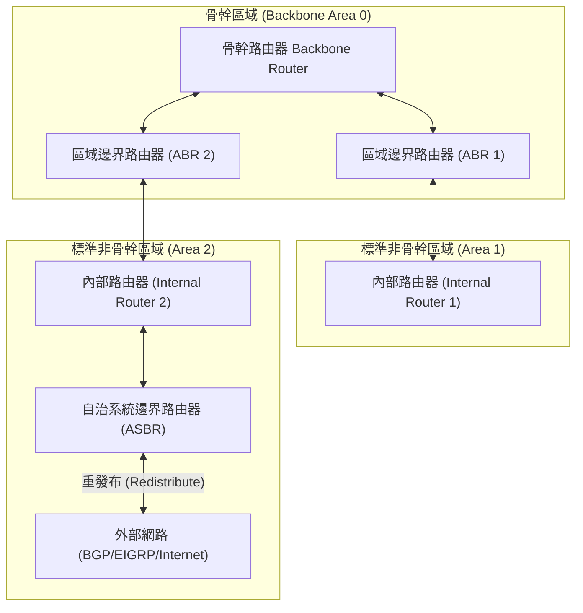

# 🛡️ CCNA-348-353 Cisco CCNA 1 Lesson 頁348~353：OSPF區域架構設計與骨幹Area0階層模型

> **課程主題**：OSPF 階層化區域（Hierarchical Routing）、骨幹 Area 0 與路由器角色分工  
> **授課講師**：授課講師（資安與網路認證原廠認證講師）  
> **核心模組**：Cisco CCNA 1 Chapter 9: Multi-Area OSPF Architecture  
> **學習目標**：掌握區域劃分對 CPU/LSDB 的減負效益、骨幹區域 Area 0 星狀拓撲及 ABR/ASBR 定位  
> **關聯文件**：[📄 完整原話逐字稿 (CCNA1-Lesson-348-353-OSPF區域架構設計與骨幹Area0階層模型-proofread.md)](./CCNA1-Lesson-348-353-OSPF區域架構設計與骨幹Area0階層模型-proofread.md)

---

## 🏛️ 核心架構與概念流轉圖

---

## 🔬 技術精華與核心考點解析

### 1. 多區域 OSPF 核心優勢
- **縮小 LSDB 容量**：各區域內的拓撲細節由 ABR 進行摘要，單一區域內的鏈路變動不會引起全網 SPF 重算。
- **限制 LSA 泛洪範圍**：Type 1/Type 2 LSA 嚴格限制在區域內部，跨區由 ABR 生成 Type 3 網路摘要 LSA。
- **提升路由彙總彈性**：可在 ABR 邊界執行跨區網段彙總（Route Summarization），大幅縮減全網路由表條目。

### 2. 路由器四種角色定義
1. **內部路由器（Internal Router）**：所有介面皆屬於同一個非骨幹區域。
2. **骨幹路由器（Backbone Router）**：至少有一個介面屬於 Area 0。
3. **區域邊界路由器（ABR - Area Border Router）**：連接 Area 0 與一個或多個非骨幹區域，維護多個獨立的 LSDB。
4. **自治系統邊界路由器（ASBR - Autonomous System Boundary Router）**：連接外部其他路由網域（如 RIP、BGP、靜態路由）並執行路由重發布（Redistribution）。

---

## 💡 關鍵總結與考試應對重點

1. **架構鐵則：多區域 OSPF 設計中，所有非骨幹區域（Area 1, 2...）在實體或邏輯上必須直接連接至骨幹區域 Area 0！**
2. **單區域考點：若企業僅配置單一區域（Single-Area），該區域依法規推薦一律配置為 Area 0。**
