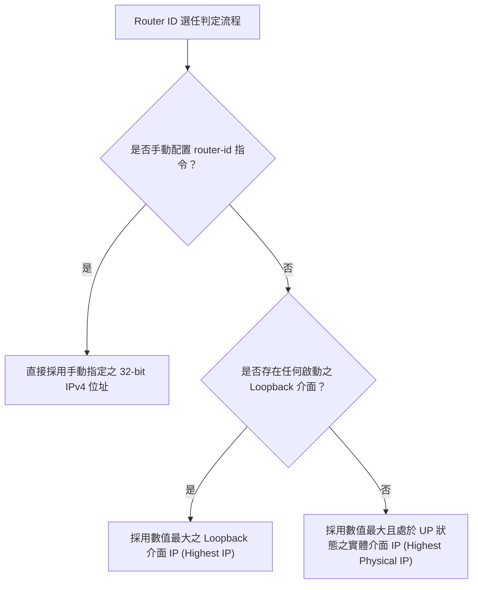

# 🛡️ CCNA-354-364 Cisco CCNA 1 Lesson 頁354~364：OSPF單區域配置指令與RouterID選任機制

> **課程主題**：Cisco IOS OSPFv2 單區域配置、Router ID 判定優先權與 Wildcard Mask 匹配實務  
> **授課講師**：授課講師（資安與網路認證原廠認證講師）  
> **核心模組**：Cisco CCNA 1 Chapter 9: OSPFv2 Configuration & Router ID  
> **學習目標**：掌握 `router ospf` 程序 ID、`router-id` 指派優先順序、`network` 萬用遮罩宣告及狀態檢查  
> **關聯文件**：[📄 完整原話逐字稿 (CCNA1-Lesson-354-364-OSPF單區域配置指令與RouterID選任機制-proofread.md)](./CCNA1-Lesson-354-364-OSPF單區域配置指令與RouterID選任機制-proofread.md)

---

## 🏛️ 核心架構與概念流轉圖



---

## 🔬 技術精華與核心考點解析

### 1. OSPF 基礎設定標準範例
```cisco
router ospf 10
 router-id 1.1.1.1
 network 10.1.1.0 0.0.0.255 area 0
 network 10.0.0.0 0.0.0.3 area 0
 passive-interface GigabitEthernet0/0
```
- **Process ID**：僅在本地路由器具有意義（Local Significance），相鄰路由器之間的 Process ID **無需相同**。
- **Wildcard Mask**：反向遮罩，`0` 代表嚴格比對，`1` 代表忽略（如 `0.0.0.255` 對應 `/24`）。
- **Passive Interface**：被動介面，該介面所屬網段會通告給 OSPF 鄰居，但該介面**停止發送與接收 OSPF Hello 封包**，保護內網安全並節省頻寬。

### 2. 驗證與診斷指令
- `show ip ospf neighbor`：檢視鄰居狀態（正常應達到 `FULL/DR` 或 `FULL/BDR` 或 `FULL/DROTHER`）。
- `show ip protocols`：檢視目前啟動之 OSPF Process ID、Router ID、通告之網段與管理距離（110）。
- `clear ip ospf process`：強制重啟 OSPF 程序以套用新變更之 Router ID。

---

## 💡 關鍵總結與考試應對重點

1. **考試常考：OSPF 的 Process ID 不需要全網一致，但 Area ID 必須與相鄰介面所屬區域完全相符才能建立鄰居關係！**
2. **優先權陷阱：變更 Router ID 後不會立即生效，必須執行 `clear ip ospf process` 或重新開機才會生效。**
