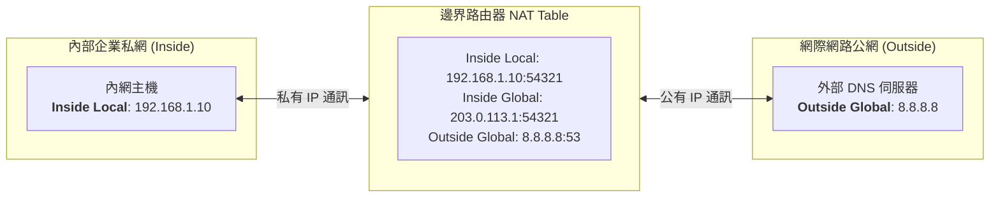

# 🛡️ CCNA-397-403 Cisco CCNA 1 Lesson 頁397~403：網路位址轉譯NAT概念與私有IP存取架構

> **課程主題**：NAT 網路位址轉譯架構、RFC 1918 私有位址規劃與 Inside/Outside 位址語意  
> **授課講師**：授課講師（資安與網路認證原廠認證講師）  
> **核心模組**：Cisco CCNA 1 Chapter 11: NAT Fundamentals & Architecture  
> **學習目標**：熟記 RFC 1918 私有 IP 範圍、區分 Inside Local / Inside Global / Outside Global 語意  
> **關聯文件**：[📄 完整原話逐字稿 (CCNA1-Lesson-397-403-網路位址轉譯NAT概念與私有IP存取架構-proofread.md)](./CCNA1-Lesson-397-403-網路位址轉譯NAT概念與私有IP存取架構-proofread.md)

---

## 🏛️ 核心架構與概念流轉圖

---

## 🔬 技術精華與核心考點解析

### 1. RFC 1918 私有 IP 保留位址
- **Class A**：`10.0.0.0 ~ 10.255.255.255`（前綴 `/8`，共 1 個 A 類網段）。
- **Class B**：`172.16.0.0 ~ 172.31.255.255`（前綴 `/12`，共 16 個 B 類網段）。
- **Class C**：`192.168.0.0 ~ 192.168.255.255`（前綴 `/16`，共 256 個 C 類網段）。
- **路由特性**：私有 IP 嚴禁在 Internet 公網核心路由器進行路由，邊界路由器遇私有目的位址一律予以丟棄。

### 2. NAT 四大核心名詞（Cisco 官方標準定義）
1. **Inside Local (內部本地位址)**：內部私網裝置所實際配置的真實私有 IP（例如 `10.1.1.5`）。
2. **Inside Global (內部全域位址)**：內部裝置穿越 NAT 轉譯後，在外部公網所呈現之合法公有 IP。
3. **Outside Local (外部本地位址)**：內部主機所見到的外部目標位址（通常與 Outside Global 相同）。
4. **Outside Global (外部全域位址)**：外部網際網路目標裝置所實際配置的真實公有 IP（例如 Google DNS `8.8.8.8`）。

---

## 💡 關鍵總結與考試應對重點

1. **名詞速記：Local 代表從內網看的位址；Global 代表從外網看的位址；Inside 代表屬於內網的裝置；Outside 代表屬於外網的裝置。**
2. **安全防護：NAT 的附帶價值是提供內網隱匿保護，外部攻擊者無法直接對 Inside Local 私有位址發起未經授權之連線。**
