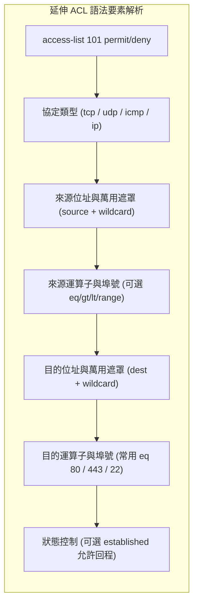

# 🛡️ CCNA-415-422 Cisco CCNA 1 Lesson 頁415~422：延伸ACL協定過濾與雙向埠號精確控制

> **課程主題**：延伸 ACL（Extended ACL）深度解析：L3/L4 複合過濾、運算子語法與部署原則  
> **授課講師**：授課講師（資安與網路認證原廠認證講師）  
> **核心模組**：Cisco CCNA 1 Chapter 10: Extended Access Control Lists  
> **學習目標**：掌握延伸 ACL 完整語法、eq/gt/lt/range 埠號運算子及「靠近來源端部署」優勢  
> **關聯文件**：[📄 完整原話逐字稿 (CCNA1-Lesson-415-422-延伸ACL協定過濾與雙向埠號精確控制-proofread.md)](./CCNA1-Lesson-415-422-延伸ACL協定過濾與雙向埠號精確控制-proofread.md)

---

## 🏛️ 核心架構與概念流轉圖



---

## 🔬 技術精華與核心考點解析

### 1. 延伸 ACL 標準配置範例
```cisco
! 允許 10.1.1.0/24 網段存取 10.3.1.100 的 Web 服務 (HTTP/HTTPS)
access-list 101 permit tcp 10.1.1.0 0.0.0.255 host 10.3.1.100 eq 80
access-list 101 permit tcp 10.1.1.0 0.0.0.255 host 10.3.1.100 eq 443

! 拒絕該網段存取該伺服器的任何其他服務
access-list 101 deny ip 10.1.1.0 0.0.0.255 host 10.3.1.100

! 允許該網段存取其他所有網際網路資源
access-list 101 permit ip 10.1.1.0 0.0.0.255 any
```

### 2. 延伸 ACL 部署黃金法則
- **靠近來源端（As close to the source as possible）**。
- 因為延伸 ACL 同時具備來源與目的地的檢驗能力，直接在來源端阻絕違規封包，可避免無效封包橫越整個企業骨幹與 WAN 鏈路，最大化節省頻寬與路由器處理負擔。

---

## 💡 關鍵總結與考試應對重點

1. **兩大 ACL 部署對比必考：標準 ACL 放靠近目的端；延伸 ACL 放靠近來源端！**
2. **常見運算子：`eq` (等於)、`neq` (不等於)、`gt` (大於)、`lt` (小於)、`range` (範圍)。**
