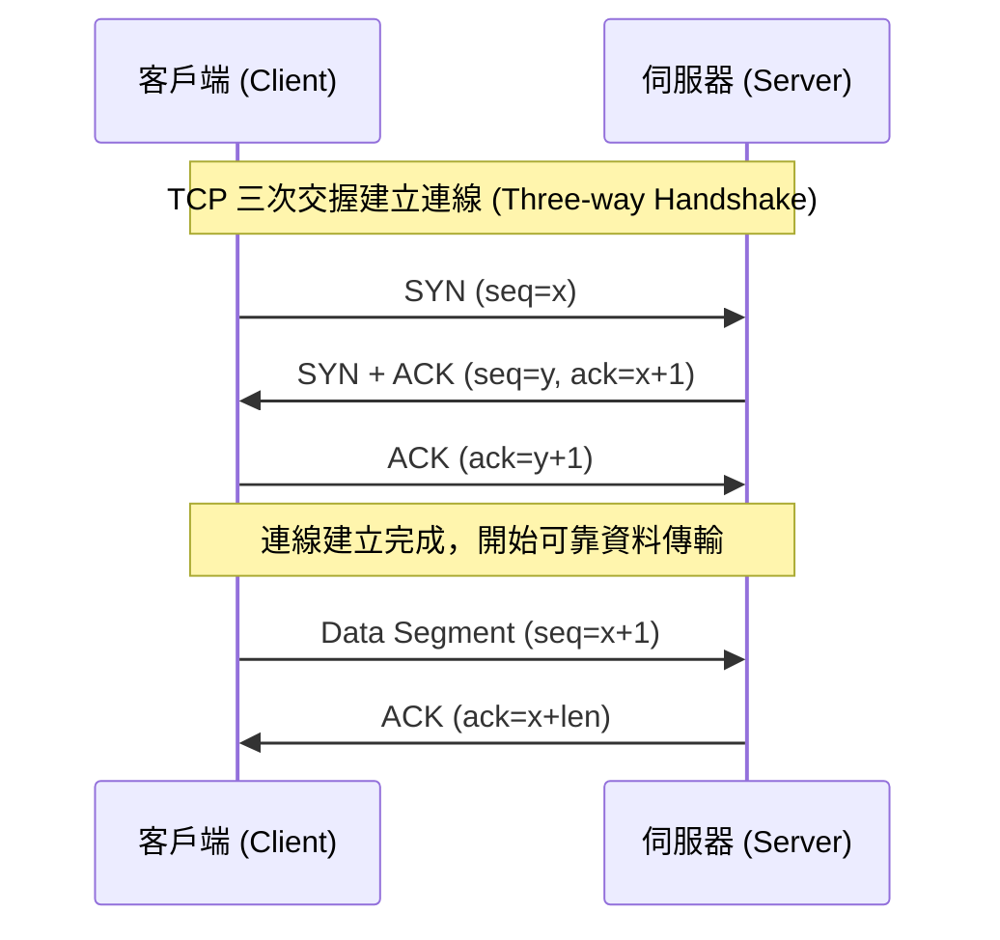

# 🛡️ CCNA-423-433 Cisco CCNA 1 Lesson 頁423~433：傳輸層 TCP 與 UDP 協定、三次交握與流量控制

> **課程主題**：TCP/IP 傳輸層核心協定深度解析：TCP vs UDP 機制與連接埠架構  
> **授課講師**：授課講師（資安與網路認證原廠認證講師）  
> **核心模組**：Cisco CCNA 1 Chapter 9: Transport Layer Protocols  
> **學習目標**：掌握 TCP 連線建立/終止機制、滑動視窗流量控制及常見應用協定對應之傳輸層協定  
> **關聯文件**：[📄 完整原話逐字稿 (CCNA1-Lesson-423-433-傳輸層TCP與UDP協定-proofread.md)](./CCNA1-Lesson-423-433-傳輸層TCP與UDP協定-proofread.md)

---

## 🏛️ 核心架構與概念流轉圖

---

## 🔬 技術精華與核心考點解析

### TCP 與 UDP 協定核心特性對比

- TCP：提供可靠傳輸、循序編號、重傳機制（Retransmission）、壅塞控制與流量控制（Flow Control），適用於 HTTP/HTTPS、SSH、FTP、SMTP。
- UDP：無連線、不保證送達、無封包重組、開銷極小（標頭僅 8 位元組），適用於 DNS 查詢、DHCP、TFTP、VoIP 及即時串流。

### TCP 連線管理機制

- 連線建立：SYN -> SYN+ACK -> ACK（三次交握）。
- 連線終止：FIN -> ACK -> FIN -> ACK（四次揮手）。
- 滑動視窗（Sliding Window）：發送端在收到 ACK 前能連續發送的資料量，依據接收端緩衝區動態調整以防溢位。

---

## 💡 關鍵總結與考試應對重點

1. **考試常考：DNS 查詢使用 UDP 53，但 DNS 區域傳送（Zone Transfer）使用 TCP 53。**
1. **考試重點：TCP 標頭長度為 20-60 位元組，UDP 標頭固定為 8 位元組。**
