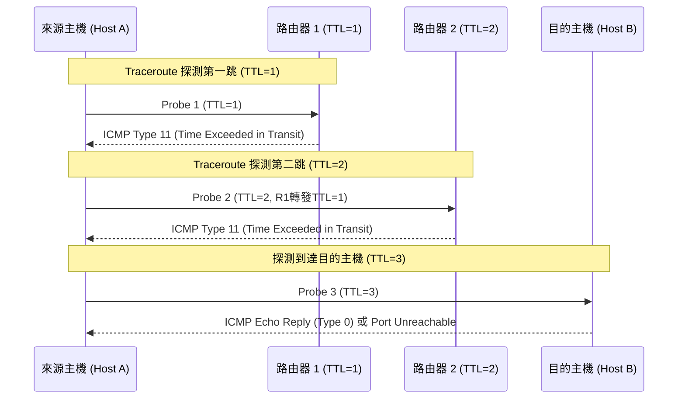

# 🛡️ CCNA-433-444 Cisco CCNA 1 Lesson 頁433~444：ICMP 協定運作、Ping、Traceroute 與網路診斷

> **課程主題**：ICMP 錯誤回報與網路連通性診斷工具深度剖析  
> **授課講師**：授課講師（資安與網路認證原廠認證講師）  
> **核心模組**：Cisco CCNA 1 Chapter 10: Network Diagnostics & ICMP  
> **學習目標**：掌握 ICMP 封包格式、Ping 與 Traceroute 之 TTL 逐跳探測原理及故障排除技巧  
> **關聯文件**：[📄 完整原話逐字稿 (CCNA1-Lesson-433-444-ICMP協定與網路診斷-proofread.md)](./CCNA1-Lesson-433-444-ICMP協定與網路診斷-proofread.md)

---

## 🏛️ 核心架構與概念流轉圖

---

## 🔬 技術精華與核心考點解析

### 常見 ICMP 類型（Type）與代碼（Code）

- Type 8 / Code 0：Echo Request（Ping 請求）。
- Type 0 / Code 0：Echo Reply（Ping 回覆）。
- Type 3：Destination Unreachable（目的不可達，Code 0 為網路不可達，Code 1 為主機不可達，Code 3 為連接埠不可達）。
- Type 11：Time Exceeded（傳輸逾時，TTL 遞減至 0）。

### Traceroute 運作原理

- 利用 IP 標頭的 TTL（Time-to-Live）欄位：發送第 1 個封包 TTL=1，第一跳路由器扣減至 0 並丟棄封包，回送 ICMP Type 11，藉此獲取第 1 跳路由器 IP；依序遞增 TTL 獲取沿途路徑所有節點。

---

## 💡 關鍵總結與考試應對重點

1. **考試常考：Ping 使用 ICMP Type 8 和 Type 0；Traceroute 在 Windows 預設使用 ICMP Echo，在 Linux/Cisco 預設使用 UDP 高號埠。**
1. **若 Ping 收到 'Destination Host Unreachable'，代表最後一跳路由器無法透過 ARP 找到目的主機；若收到 'Request Timed Out'，通常代表封包被防火牆丟棄或路由黑洞。**
