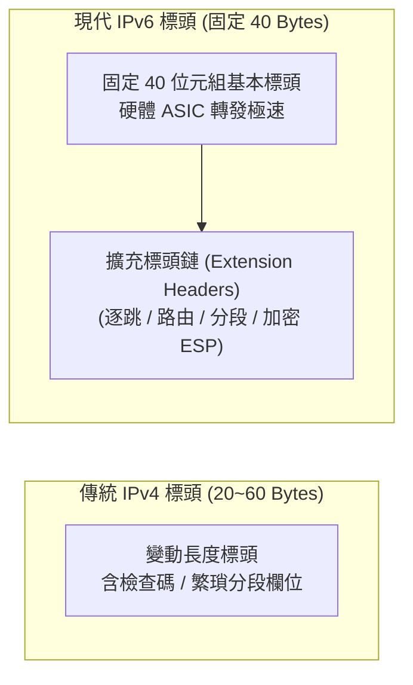

# 🛡️ CCNA-445-452 Cisco CCNA 1 Lesson 頁445~452：IPv6 協定架構、128位元定址與擴充標頭設計

> **課程主題**：下一代網際網路協定 IPv6 架構基礎與標頭演化革新  
> **授課講師**：授課講師（資安與網路認證原廠認證講師）  
> **核心模組**：Cisco CCNA 1 Chapter 11: Introduction to IPv6  
> **學習目標**：掌握 IPv6 定址位元長度、40 位元組固定標頭結構及廢除廣播之架構改良  
> **關聯文件**：[📄 完整原話逐字稿 (CCNA1-Lesson-445-452-IPv6協定架構與設計-proofread.md)](./CCNA1-Lesson-445-452-IPv6協定架構與設計-proofread.md)

---

## 🏛️ 核心架構與概念流轉圖

---

## 🔬 技術精華與核心考點解析

### IPv6 標頭簡化設計革新

- IPv6 基本標頭固定為 40 位元組，取消了 IPv4 繁瑣的 Header Checksum（交由 L2 與 L4 驗證），大幅減輕路由器 CPU 負擔。
- 取消中間路由器分段功能：Path MTU Discovery 確保由發送端來源主機完成分段。

### 三大傳輸類型革新

- Unicast（單播）：一對一傳送。
- Multicast（多播）：一對一組傳送，取代傳統 IPv4 廣播（Broadcast），消除全網廣播風暴。
- Anycast（任播）：一對最近端傳送，常用於全球 DNS 與 CDN 負載平衡。

---

## 💡 關鍵總結與考試應對重點

1. **考試常考：IPv6 徹底廢除了廣播（Broadcast）概念，原廣播需求皆改由特化 Multicast 取代！**
1. **IPv6 基本標頭固定大小為 40 位元組，IPv4 最小為 20 位元組。**
