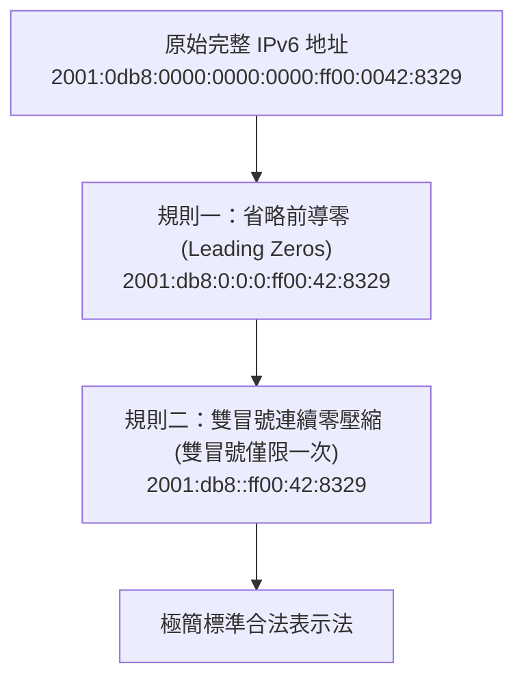

# 🛡️ CCNA-451-457 Cisco CCNA 1 Lesson 頁451~457：IPv6 地址縮寫簡化兩大黃金規則與實務練習

> **課程主題**：IPv6 128 位元地址書寫規範與兩大合法簡化原則  
> **授課講師**：授課講師（資安與網路認證原廠認證講師）  
> **核心模組**：Cisco CCNA 1 Chapter 11: IPv6 Representation and Shortening  
> **學習目標**：熟練前導零省略與雙冒號壓縮技巧，確保在 Cisco CLI 與認證考試中精準配置  
> **關聯文件**：[📄 完整原話逐字稿 (CCNA1-Lesson-451-457-IPv6地址縮寫與簡化規則-proofread.md)](./CCNA1-Lesson-451-457-IPv6地址縮寫與簡化規則-proofread.md)

---

## 🏛️ 核心架構與概念流轉圖

---

## 🔬 技術精華與核心考點解析

### 兩大縮寫法則核心規定

- 規則一：每個 16-bit 區塊內部的『前導零（Leading Zero）』皆可省略，例如 `01ab` -> `1ab`，`0000` -> `0`。但『後綴零（Trailing Zero）』嚴禁省略（例如 `ab00` 絕不能寫成 `ab`）。
- 規則二：連續一個或多個全為 0 的區塊，可用單一雙冒號 `::` 壓縮取代。

### 雙冒號只能使用一次之數學原因

- 若一個地址出現兩次雙冒號（如 `2001::abcd::1`），解碼時將無法確定左右兩處各自壓縮了多少個 16 位元區塊，導致數學歧義；因此全地址強制限制『雙冒號僅能出現一次』。

---

## 💡 關鍵總結與考試應對重點

1. **考試高頻必考題：給定一個完整 IPv6 地址，要求選出唯一合法壓縮格式，檢查雙冒號是否重複使用以及後導零是否被誤刪。**
1. **回環地址（Loopback）完整為 `0000:0000:0000:0000:0000:0000:0000:0001`，極致壓縮後為 `::1`。**
