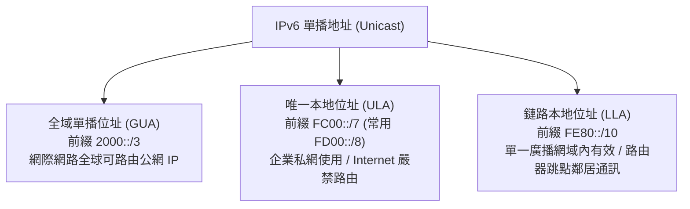

# 🛡️ CCNA-458-467 Cisco CCNA 1 Lesson 頁458~467：IPv6 地址類型分類、Unique Local (FC00::/7) 與鏈路本地位址

> **課程主題**：IPv6 單播地址三大類型深度分類與作用域（Scope）實務  
> **授課講師**：授課講師（資安與網路認證原廠認證講師）  
> **核心模組**：Cisco CCNA 1 Chapter 11: IPv6 Unicast Addressing  
> **學習目標**：掌握 GUA、ULA (FC00::/7) 與 LLA (FE80::/10) 之位址前綴與路由作用範疇  
> **關聯文件**：[📄 完整原話逐字稿 (CCNA1-Lesson-458-467-IPv6地址分類與私有範圍-proofread.md)](./CCNA1-Lesson-458-467-IPv6地址分類與私有範圍-proofread.md)

---

## 🏛️ 核心架構與概念流轉圖

---

## 🔬 技術精華與核心考點解析

### 三大單播地址前綴特徵

- GUA（Global Unicast）：前綴 `2000::/3`（目前全球分配以 `2xxx:` 或 `3xxx:` 開頭），相當於 IPv4 公網 IP。
- ULA（Unique Local）：前綴 `FC00::/7`，目前規範使用 `FD00::/8`，相當於 IPv4 的 RFC 1918 私有 IP（10.0.0.0/8 等），Internet 邊界路由器不轉發。
- LLA（Link-Local）：前綴 `FE80::/10`，僅在同一個 Layer 2 網段有效，路由器絕對不跨網段轉發，是 OSPFv3 等路由協定建立鄰居的基礎。

### EUI-64 位址產生法

- 利用主機 48-bit MAC 地址自動生成 64-bit 介面識別碼（Interface ID）：將 MAC 切半，中間插入 `FF:FE`，並將第 7 個 bit（Universal/Local bit）反轉。

---

## 💡 關鍵總結與考試應對重點

1. **考試常考：Link-Local 地址範圍為 `FE80::/10`；Unique Local 地址範圍為 `FC00::/7`。**
1. **每一張啟用 IPv6 的網路介面卡，都『必須且必然』至少具備一個 Link-Local 地址（FE80 開頭），即使尚未配置任何 GUA 公網 IP！**
