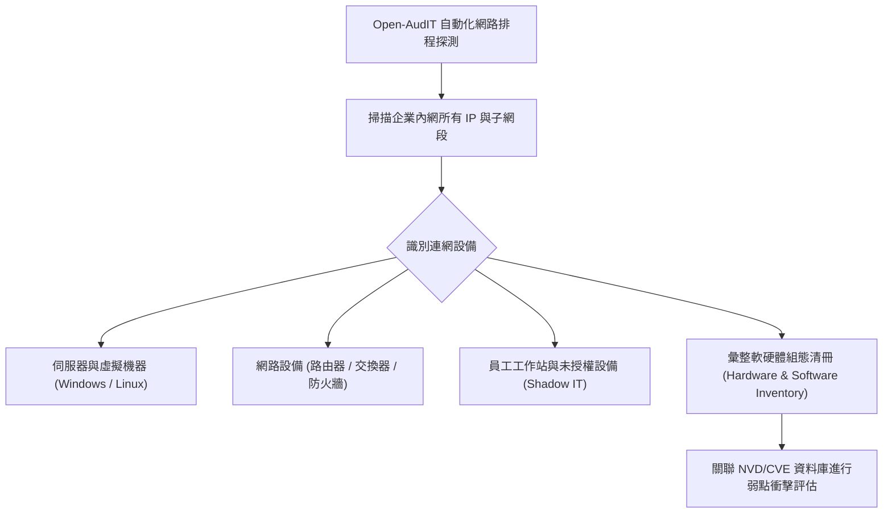

# 🛡️ SECPLUS-ASSET-MGMT CompTIA Security+ 專題延伸：開源資產管理工具、資訊資產生命週期與漏洞關聯分析

> **課程主題**：資訊資產盤點、開源 Open-AudIT 自動化探測與 Shadow IT 防範  
> **授課講師**：授課講師（資安與網路認證原廠認證講師）  
> **核心模組**：CompTIA Security+ Asset Management & Inventory Discovery  
> **學習目標**：部署自動化資產盤點系統、掌握 CIS Control #1/#2 資產清單建置要求  
> **關聯文件**：[📄 完整原話逐字稿 (SecurityPlus-Lesson-開源資產管理工具與企業軟體盤點-proofread.md)](./SecurityPlus-Lesson-開源資產管理工具與企業軟體盤點-proofread.md)

---

## 🏛️ 核心架構與概念流轉圖

---

## 🔑 重點提要 (Key Takeaways)

1. **CIS 關鍵控制項第一條**：CIS Controls 第一項即為「企業資產盤點與控制」，無法掌握全網設備就無法確保邊界安全。
2. **影子 IT（Shadow IT）威脅**：部門私自架設未報備的伺服器或使用未受控 SaaS，往往因缺乏安全補丁成為駭客入侵的第一個跳板。
